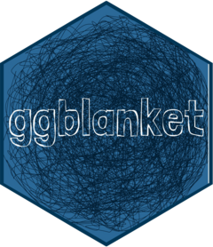

<!-- README.md is generated from README.Rmd. Please edit that file -->

```{r, include = FALSE}
knitr::opts_chunk$set(
  collapse = TRUE,
  comment = "#>",
  fig.path = "man/figures/README-",
  message = FALSE,
  warning = FALSE,
  fig.width = 6,
  fig.asp = 0.6,
  out.width = "75%",
  dpi = 300)
```

# ggblanket 

<!-- badges: start -->
  [](https://CRAN.R-project.org/package=ggblanket)
[](https://r-pkg.org/pkg/ggblanket)
[](https://r-pkg.org/pkg/ggblanket)
[](https://r-pkg.org/pkg/ggblanket)
[](https://r-pkg.org/pkg/ggblanket)
[](https://github.com/davidhodge931/ggblanket/actions/workflows/R-CMD-check.yaml)
<!-- badges: end -->

## Overview

ggblanket is a package of ggplot2 wrapper functions.

The primary objective is to **simplify ggplot2 visualisation**.

Secondary objectives relate to:

* Design: produce well-designed visualisation
* Alignment: use conventions aligned with ggplot2
* Scope: cover much of what ggplot2 does.

## Installation

``` r
install.packages("ggblanket")
```
## Example

```{r, fig.asp=0.6}
library(ggblanket)
library(palmerpenguins)
library(tidyverse)

penguins |>
  gg_histogram(
    x = flipper_length_mm,
    col = species,
  )
```

## Get started

Click [here](https://davidhodge931.github.io/ggblanket/articles/ggblanket.html) to start learning how ggblanket works.

## Thank you

Thanks to all authors of ggplot2, tidyverse, and the wider R ecosystem. 

This R package is dedicated to my Dad (Peter Hodge, 1953–2023).
