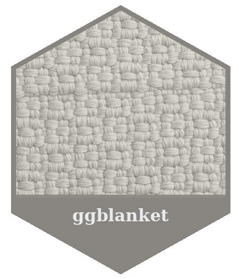

<!-- README.md is generated from README.Rmd. Please edit that file -->

```{r, include = FALSE}
knitr::opts_chunk$set(
  collapse = TRUE,
  comment = "#>",
  fig.path = "man/figures/README-",
  message = FALSE,
  warning = FALSE,
  fig.width = 6,
  fig.asp = 0.6,
  out.width = "75%",
  dpi = 300)
```

# ggblanket 

<!-- badges: start -->
[](https://CRAN.R-project.org/package=ggblanket)
[](https://r-pkg.org/pkg/ggblanket)
<!-- badges: end -->

## Objective

ggblanket is a package of ggplot2 wrapper functions for publication-quality 
visualisation. It seeks to support well-designed visualisation, while aligning 
as much as possible with ggplot2 and tidyverse conventions.

## Installation

Install from CRAN, or development version from [GitHub](https://github.com/).

```r
install.packages("ggblanket") 
pak::pak("davidhodge931/ggblanket")
```

## Example

```{r}
library(ggblanket)
library(ggplot2)
library(dplyr)

set_blanket()

iris |>
  gg_point(
    x = Sepal.Width,
    y = Sepal.Length,
    fill = Species,
    shape = Species,
  )
```

```{r}
ggplot2::economics_long |>
  gg_area(
    x = date,
    y = value01,
    facet = variable,
  )

```

## How it works

Use the `gg_*()` wrapper functions to:

* Plot a ggplot and geom layer in a single function
* Map aesthetic and facet variables as bare names
* Get `colour` and `colour_*` arguments inherited from `fill` and `fill_*` arguments
* Change scale arguments easily with prefixed arguments
* If lower x/y scale limit is zero, get default scale expansion of `ggplot2::expansion(c(0, 0.5))`
* Access to other arguments within relevant `geom_*` function via `...`
* Get global `set_blanket()` setting defaults.

Use the global setup function, `set_blanket()`, to:

* Adjust the global theme
* Adjust the global option for how themes are to be refined based on plot scale types etc
* Adjust the global theme `fill`, `colour`, `linewidth`, `shape`, `linetype`, `size`, `stroke`
* Adjust the global theme `fill_palette`, `colour_palette`, `shape_palette` and `linetype_palette`
* Adjust the global option for `colour_border`, which is a function to transform the `colour` and `colour_palette` with input of the `fill` and `fill_palette` respectively
* Adjust the global option for `fill_border`, which is a function to transform the `fill` and `fill_palette` with input of the `colour` and `colour_palette` respectively

## Other packages

This package is part of a group of related packages built to extend [ggplot2](https://ggplot2.tidyverse.org).

<table><tr>
<td align="center"><a href="https://davidhodge931.github.io/ggblanket/"></a></td>
<td align="center"><a href="https://davidhodge931.github.io/ggrefine/"></a></td>
<td align="center"><a href="https://davidhodge931.github.io/ggscribe/"></a></td>
<td align="center"><a href="https://davidhodge931.github.io/ggwidth/"></a></td>
<td align="center"><a href="https://davidhodge931.github.io/blends/"></a></td>
<td align="center"><a href="https://davidhodge931.github.io/jumble/"></a></td>
</tr></table>
