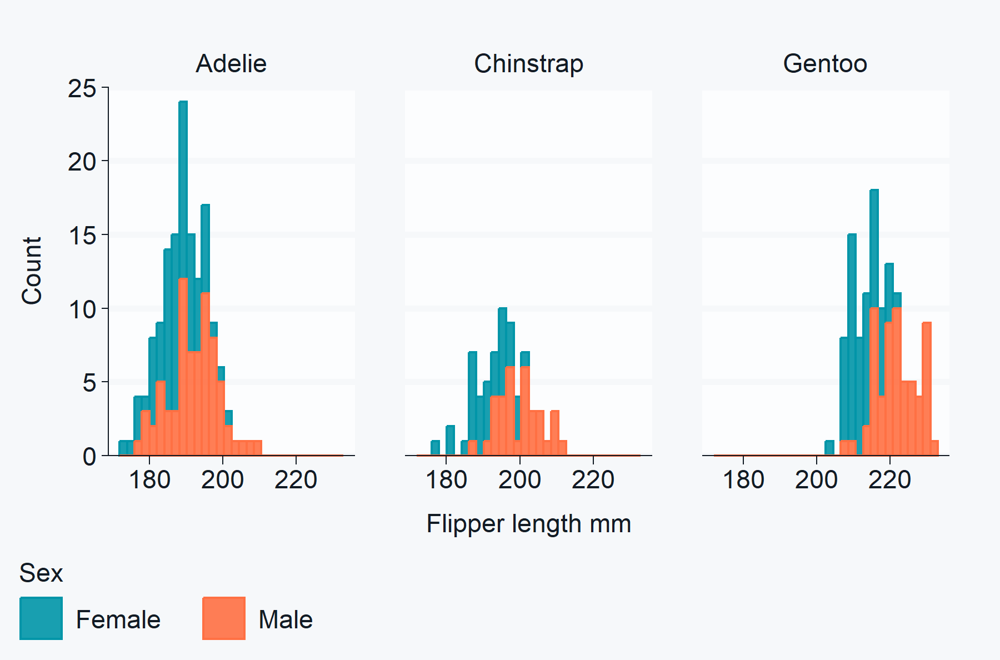

<!-- README.md is generated from README.Rmd. Please edit that file -->

# ggblanket 

<!-- badges: start -->

[](https://CRAN.R-project.org/package=ggblanket)
[](https://r-pkg.org/pkg/ggblanket)
[](https://r-pkg.org/pkg/ggblanket)
[](https://r-pkg.org/pkg/ggblanket)
[](https://r-pkg.org/pkg/ggblanket)
<!-- badges: end -->

## Overview

ggblanket is a package of ggplot2 wrapper functions.

The primary objective is to **simplify ggplot2 visualisation**.

Secondary objectives relate to:

- Design: produce well-designed visualisation
- Alignment: use conventions aligned with ggplot2
- Scope: cover the majority of what ggplot2 does.

## Installation

``` r
install.packages("ggblanket")
```

## Example

``` r
library(ggblanket)
library(ggplot2)
library(dplyr)
library(palmerpenguins)

# theme_set(light_mode_t())

penguins |>
  gg_histogram(
    x = flipper_length_mm,
    col = species,
    title = "Penguin flipper length by species",
    subtitle = "Palmer Archipelago, Antarctica",
    caption = "Source: Gorman, 2020", 
    col_title = "",
    theme = grey_mode_t(),
  ) 
```



## Get started

Click
[here](https://davidhodge931.github.io/ggblanket/articles/ggblanket.html)
to start learning how ggblanket works.

## Thank you

Thanks to all authors of ggplot2, tidyverse, and the wider R ecosystem.

This R package is dedicated to my Dad (Peter Hodge, 1953-2023).
