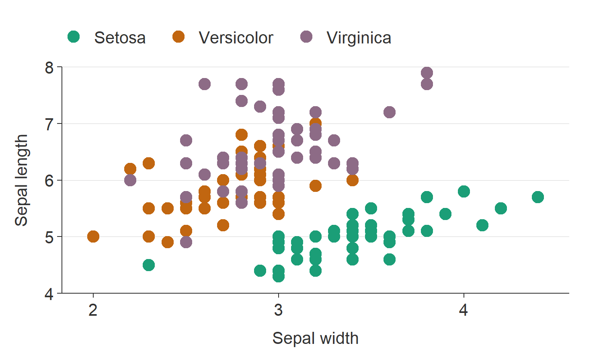

<!-- README.md is generated from README.Rmd. Please edit that file -->

# ggblanket 

<!-- badges: start -->

[](https://CRAN.R-project.org/package=ggblanket)
[](https://r-pkg.org/pkg/ggblanket)
[](https://r-pkg.org/pkg/ggblanket)
[](https://r-pkg.org/pkg/ggblanket)
[](https://r-pkg.org/pkg/ggblanket)
<!-- badges: end -->

## Overview

{ggblanket} is a package of wrapper functions around the amazing
‘ggplot2’ package to **simplify pretty visualisation**.

With this objective in mind, the {ggblanket} package:

1.  uses `gg_*` functions that each wrap a `ggplot2::ggplot` call with a
    single `ggplot2::geom_*` function
2.  merges col and fill aesthetics into a single col aesthetic
3.  provides colour customisation via pal and alpha arguments
4.  treats faceting as an aesthetic
5.  provides good-looking default x and y scales
6.  provides prefixed arguments for customisable scale adjustment
7.  arranges horizontal geom y and col labels etc to be in correct order
8.  converts unspecified titles to snakecase::to_sentence by default
9.  provides access to all of the relevant geom arg’s through the dots
    argument
10. supports ggplotly use.
11. provides a `gg_blank` function for even more flexibility.

## Installation

Install either from CRAN with:

``` r
install.packages("ggblanket")
```

Or install the development version with:

``` r
# install.packages("devtools")
devtools::install_github("davidhodge931/ggblanket")
```

## Website

Click [here](https://davidhodge931.github.io/ggblanket/) for the
{ggblanket} website.

## Examples

``` r
library(dplyr)
library(ggplot2)
library(ggblanket)
library(palmerpenguins)
```

1.  {ggblanket} uses `gg_*` functions that each wrap a `ggplot2::ggplot`
    call with a single `ggplot2::geom_*` function.

``` r
iris %>%
  gg_point(x = Sepal.Width, y = Sepal.Length, col = Species)
```

<!-- -->

2.  {ggblanket} merges col and fill aesthetics into a single col
    aesthetic.

``` r
penguins %>% 
  gg_histogram(x = body_mass_g, col = species) 
```

<!-- -->

3.  {ggblanket} provides colour customisation via pal and alpha
    arguments.

``` r
penguins %>% 
  gg_density(x = body_mass_g, col = species, 
             pal = pals::brewer.dark2(3), 
             alpha = 0.5)
```

<!-- -->

4.  {ggblanket} treats faceting as an aesthetic.

``` r
penguins %>% 
  tidyr::drop_na() %>%
  mutate(sex = stringr::str_to_sentence(sex)) %>% 
  gg_violin(x = sex, y = body_mass_g, facet = species)
```

<!-- -->

5.  {ggblanket} provides good-looking default x and y scales.

For where:

-   x categorical and y numeric/date: y_limits default to min/max of
    y_breaks with y_expand of c(0, 0)
-   y categorical and x numeric/date: x_limits default to min/max of
    x_breaks with x_expand of c(0, 0)
-   x numeric/date and y numeric/date: y_limits default to min/max of
    y_breaks with y_expand of c(0, 0), and x_limits default to NULL
    (i.e. min/max of x variable) and x_expand of c(0.025, 0.025)

``` r
storms %>%
  group_by(year) %>%
  filter(between(year, 1980, 2020)) %>%
  summarise(wind = mean(wind, na.rm = TRUE)) %>%
  gg_col(
    x = year,
    y = wind,
    title = "Storm wind speed",
    subtitle = "USA average storm wind speed, 1980\u20132020",
    y_title = "Wind speed (knots)",
    caption = "Source: NOAA"
  ) 
```

<!-- -->

6.  {ggblanket} provides prefixed arguments for customisable scale
    adjustment.

This is designed to work with the Rstudio autocomplete to help you find
the adjustment you need. Press the tab key after typing `x_`,`y_`,
`col_` or `facet_` to access this. Then use arrow keys, and press tab
again to select.

Available arguments are for `x`, `y`, `col` and `facet`:
``` *_breaks``*_limits ```, `*_include`, `*_expand`, and `*_labels`.

For `x` and `y`, there is also a `*_trans` argument.

For `col` and `facet`, there is also a `*_intervals` argument.

``` r
penguins %>%
  gg_jitter(
    x = species,
    y = body_mass_g,
    col = flipper_length_mm,
    position = ggplot2::position_jitter(width = 0.2, height = 0, seed = 123), 
    col_intervals = ~ santoku::chop_quantiles(.x, probs = seq(0, 1, 0.25)),
    col_legend_place = "b",
    y_include = 0,
    y_breaks = scales::breaks_width(1500), 
    y_labels = scales::label_number()
  )
```

<!-- -->

7.  {ggblanket} arranges horizontal geom y and col labels etc to be in
    correct order.

``` r
penguins %>%
  tidyr::drop_na() %>% 
  group_by(species, sex, island) %>%
  summarise(body_mass_kg = mean(body_mass_g) / 1000) %>%
  gg_col(x = body_mass_kg, y = species, col = sex, facet = island,
         col_labels = stringr::str_to_sentence, 
         position = "dodge", 
         col_legend_place = "b")
```

<!-- -->

8.  {ggblanket} converts unspecified titles to snakecase::to_sentence by
    default.

``` r
penguins %>%
  group_by(species, sex) %>%
  summarise(across(body_mass_g, ~ round(mean(.x, na.rm = TRUE)), 0)) %>% 
  gg_tile(sex, species, col = body_mass_g, 
          x_labels = snakecase::to_sentence_case,
          pal = pals::brewer.blues(9),
          width = 0.9, 
          height = 0.9, 
          title = "Average penguin body mass",
          subtitle = "Palmer Archipelago, Antarctica",
          theme = gg_theme(pal_axis = "#ffffff", pal_ticks = "#ffffff")) +
  geom_text(aes(label = body_mass_g), col = "#232323", size = 3.5) 
```

<!-- -->

9.  {ggblanket} provides access to all of the relevant geom arg’s
    through the dots argument.

``` r
penguins %>%
  tidyr::drop_na() %>% 
  gg_smooth(
    x = bill_length_mm,
    y = flipper_length_mm,
    col = species,
    level = 0.99,
    size = 0.5
    ) 
```

<!-- -->

10. {ggblanket} supports ggplotly use.

`ggplotly` won’t work in all situations, and with all functions and
arguments. But it does work a lot of the time.

``` r
iris %>% 
  mutate(Species = stringr::str_to_sentence(Species)) %>% 
  add_tooltip_text(titles = snakecase::to_sentence_case) %>% 
  gg_point(x = Sepal.Width, 
           y = Sepal.Length, 
           col = Species, 
           text = text, 
           theme = gg_theme("helvetica", y_grid = TRUE)) %>% 
  plotly::ggplotly(tooltip = "text")
```


11. {ggblanket} provides a `gg_blank` function for even more
    flexibility.

``` r
penguins %>%
  tidyr::drop_na() %>%
  mutate(sex = stringr::str_to_sentence(sex)) %>% 
  gg_blank(x = flipper_length_mm, col = sex, facet = species, 
           col_legend_place = "b") +
  geom_histogram(aes(y = after_stat(density)), alpha = 0.9) +
  labs(y = "Density")
```

<!-- -->

``` r
penguins %>%
  tidyr::drop_na() %>%
  mutate(sex = stringr::str_to_sentence(sex)) %>%
  group_by(species, sex) %>%
  summarise(
    bill_length_mm = round(mean(bill_length_mm, na.rm = TRUE), 0),
    n = n(),
    se = bill_length_mm / sqrt(n),
    upper = bill_length_mm + 1.96 * se,
    lower = bill_length_mm - 1.96 * se
  ) %>%
  gg_blank(
    x = sex,
    y = bill_length_mm,
    col = sex,
    facet = species,
    label = bill_length_mm,
    ymin = lower,
    ymax = upper,
    yend = upper + 10,
    y_include = 0
  ) +
  geom_col(width = 0.75, alpha = 0.9) +
  geom_errorbar(width = 0.1, col = "black") +
  geom_text(aes(y = upper + 5), fill = NA, size = 3)
```

<!-- -->

``` r
x_zoom <- c(4, 6)

iris %>%
  gg_blank(
    x = Petal.Length,
    y = Petal.Width,
    col = Species,
    facet_scales = "free_x",
    col_legend_place = "b",
    col_labels = stringr::str_to_sentence,
    y_expand = expansion(mult = c(0, 0.05))
  ) +
  geom_rect(aes(
    xmin = x_zoom[1] * 0.975,
    xmax = x_zoom[2] * 1.025,
    ymin = 0,
    ymax = Inf
  ),
  col = NA,
  fill = "#F0F0F0"
  ) +
  geom_point() +
  ggforce::facet_zoom(xlim = c(x_zoom[1], x_zoom[2]), zoom.size = 1) +
  theme(strip.background = element_rect(fill = "#E6E6E6")) +
  theme(panel.spacing = unit(0.2, "cm"))
```

<!-- -->
