<!-- README.md is generated from README.Rmd. Please edit that file -->

# ggblanket 

<!-- badges: start -->

[](https://CRAN.R-project.org/package=ggblanket)
[](https://r-pkg.org/pkg/ggblanket)
[](https://r-pkg.org/pkg/ggblanket)
[](https://r-pkg.org/pkg/ggblanket)
[](https://r-pkg.org/pkg/ggblanket)
<!-- badges: end -->

## Overview

{ggblanket} is a package of {ggplot2} wrapper functions to **simplify
visualisation**.

To do this, the {ggblanket} package:

1.  uses `gg_*` functions that wrap a single `ggplot2::geom_*` function
2.  merges col and fill aesthetics into a single `col` argument
3.  customises colours via `pal` and `alpha` arguments consistently
4.  provides a `facet` argument to facet by a single variable
5.  provides an additional `facet2` argument to facet in a grid
6.  provides prefixed arguments to help find arguments
7.  uses nice numeric/date default scales.
8.  provides a `theme` argument for customisation.
9.  provides a `gg_theme` function to create a quick theme.
10. arranges horizontal plot labels to be in correct order
11. converts unspecified titles to `snakecase::to_sentence`
12. provides a `gg_blank` function for extra flexibility
13. supports nice `plotly::ggplotly` tooltips
14. provides access to all other `geom_*` arguments via `...`
15. is useful for creating customised functions with your own defaults

If you would like to show your appreciation for {ggblanket}, you can
give this repository a star, or even
<a href="https://www.buymeacoffee.com/davidhodge931" target="_blank">buy
me a coffee</a>.

## Website

Click [here](https://davidhodge931.github.io/ggblanket/) for the
{ggblanket} website.

## Installation

Install either from CRAN with:

``` r
install.packages("ggblanket")
```

Or install the development version with:

``` r
# install.packages("devtools")
devtools::install_github("davidhodge931/ggblanket")
```

## Examples

``` r
library(dplyr)
library(ggplot2)
library(ggblanket)
library(palmerpenguins)
```

#### 1. {ggblanket} uses `gg_*` functions that wrap a single `ggplot2::geom_*` function.

These functions wrap a `ggplot2::ggplot(aes(...))` function that
includes any aesthetics provided with a single `ggplot2::geom_*()`
function.

``` r
iris %>%
  mutate(Species = stringr::str_to_sentence(Species)) %>% 
  gg_point(
    x = Sepal.Width, 
    y = Sepal.Length, 
    col = Species)
```

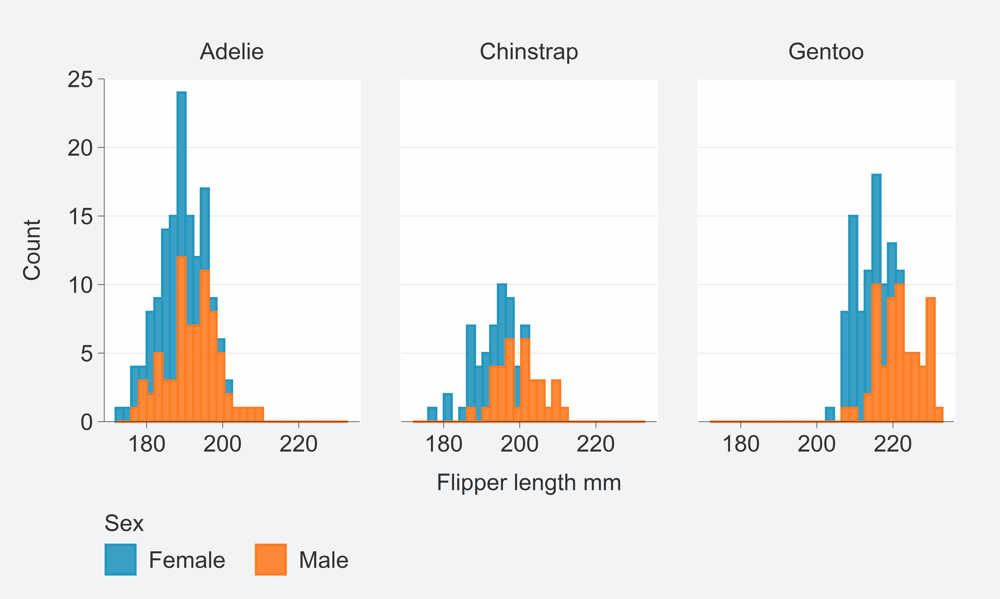

#### 2. {ggblanket} merges col and fill aesthetics into a single `col` argument.

There is no `fill` concept in {ggblanket}. Instead, `col` relates to
both the `col` and `fill` concepts of {ggplot2}. A message is provided
to users in the console to remind them of this.

``` r
penguins %>% 
  gg_histogram(
    x = body_mass_g, 
    col = species) 
```

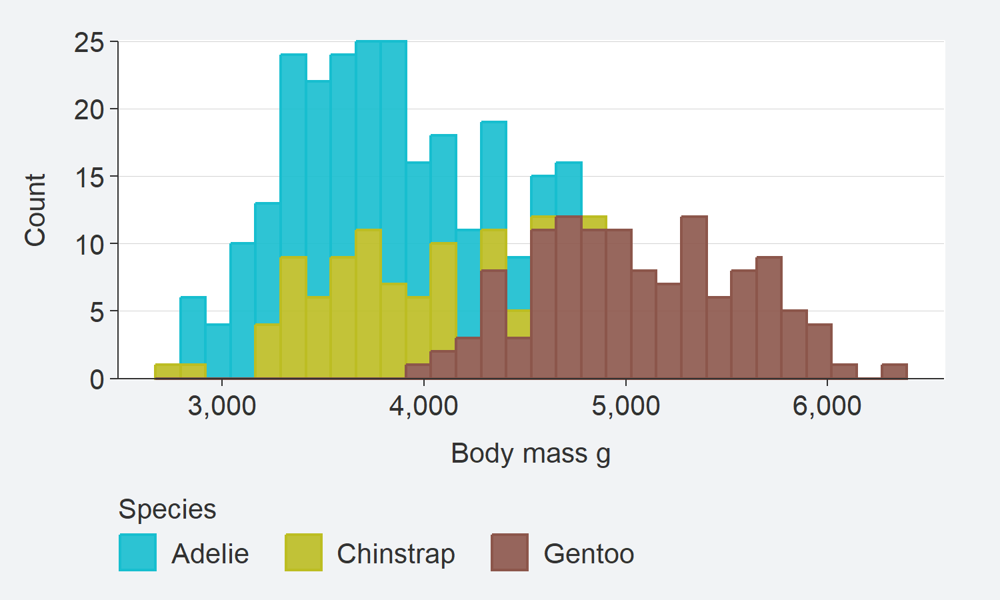

#### 3. {ggblanket} customises colours via `pal` and `alpha` arguments consistently.

These arguments work in the same way regardless of whether a `col`
variable is specified or not. This is therefore one less thing for users
to remember.

``` r
penguins %>% 
  mutate(sex = stringr::str_to_sentence(sex)) %>% 
  group_by(species, sex) %>% 
  summarise(body_mass_g = mean(body_mass_g, na.rm = TRUE)) %>% 
  gg_col(
    x = species, 
    y = body_mass_g, 
    col = sex, 
    position = position_dodge2(preserve = "single"),
    pal = c("#1B9E77", "#9E361B"))
```

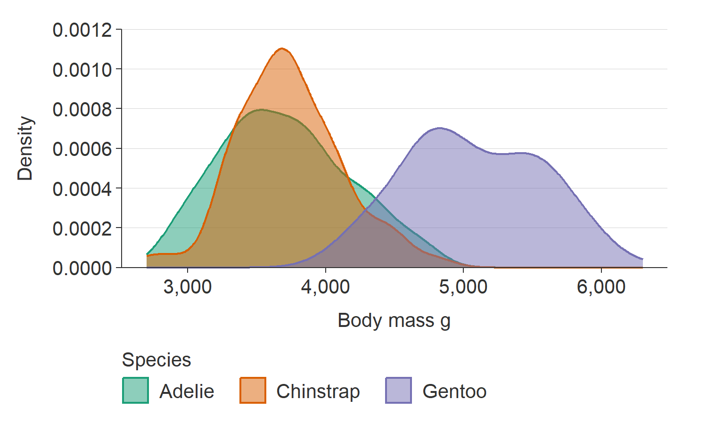

#### 4. {ggblanket} provides a `facet` argument to facet by a single variable.

Facetting is treated as if it is an aesthetic, where the users just
provide an unquoted variable to facet by. A message is provided to users
in the console to remind them of this.

``` r
penguins %>% 
  tidyr::drop_na(sex) %>%
  mutate(sex = stringr::str_to_sentence(sex)) %>% 
  gg_violin(
    x = sex, 
    y = body_mass_g, 
    facet = species, 
    y_include = 0, 
    y_breaks = scales::breaks_width(1000),
    pal = "#1B9E77")
```

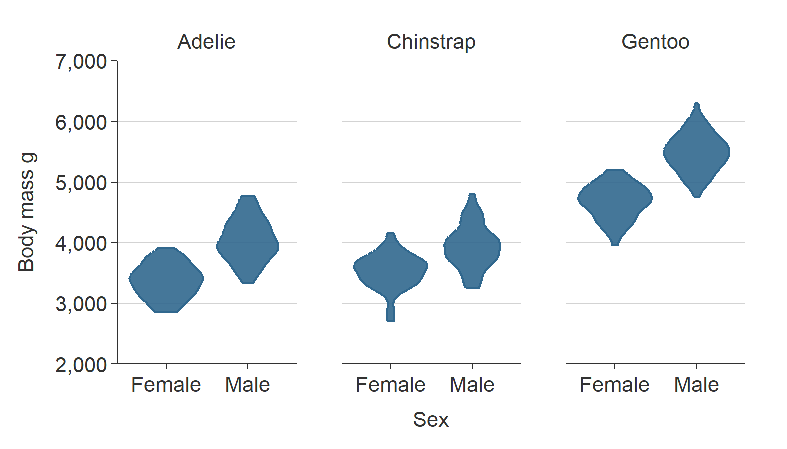

#### 5. {ggblanket} provides an additional `facet2` argument to facet in a grid.

If only `facet` is provided, the `gg_*` function under the hood uses
`ggplot2::facet_wrap` to wrap by that variable.

However, if `facet2` is also provided, then the gg\_\* function uses
`ggplot2::facet_grid` to facet in grid of `facet` by `facet2`.

``` r
penguins %>% 
  tidyr::drop_na(sex) %>% 
  mutate(sex = stringr::str_to_sentence(sex)) %>% 
  gg_point(
    x = bill_length_mm, 
    y = body_mass_g,
    col = sex,
    facet = species,
    facet2 = sex, 
    y_breaks = scales::breaks_width(1500), 
    size = 1)
```

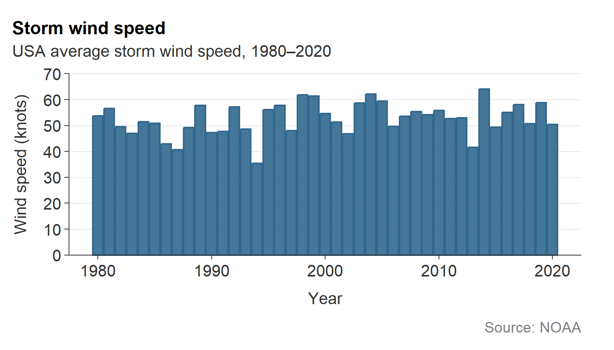

#### 6. {ggblanket} provides prefixed arguments for customisation.

This is designed to work with the Rstudio autocomplete to help you find
the adjustment you need. Press the tab key after typing `x_`,`y_`,
`col_` or `facet_` to access this. Then use arrow keys, and press tab
again to select.

In general, arguments follow the prefix with the argument name that they
relate to in the `ggplot2` function (e.g. `scale_*_continuous`,
`facet_wrap` or `facet_grid`).

Available arguments are:

-   `*_breaks`: Adjust the breaks of an axis
-   `*_expand`: Adjust the padding beyond the limits
-   `*_include`: Include a value within a scale
-   `*_labels`: Adjust the labels on the breaks
-   `*_limits`: Adjust the limits
-   `*_trans`: Transform an axis
-   `*_sec_axis`: Add a secondary axis
-   `*_title`: Add a title
-   `col_legend_place`: Place to put the legend (e.g. “r”)
-   `col_legend_ncol`: Number of columns to arrange legend elements into
-   `col_legend_nrow`: Number of rows to arrange legend elements into
-   `facet_scales`: How facet scales are to be treated
-   `facet_space`: Whether facet space is to be treated in the grid
-   `facet_ncol`: How many columns to wrap facets into  
-   `facet_nrow`: How many rows to wrap facets into

Note that {ggblanket} keeps out-of-bound values (i.e. uses
scales::oob_keep under the hood). However, you can zoom in using
`coord = coord_cartesian(xlim = ..., ylim = ...)`.

``` r
penguins %>%
  gg_jitter(
    x = species,
    y = body_mass_g,
    col = flipper_length_mm,
    position = ggplot2::position_jitter(width = 0.2, height = 0, seed = 123), 
    col_legend_place = "r",
    y_include = 0,
    y_breaks = scales::breaks_width(1500), 
    y_labels = scales::label_number()
  )
```

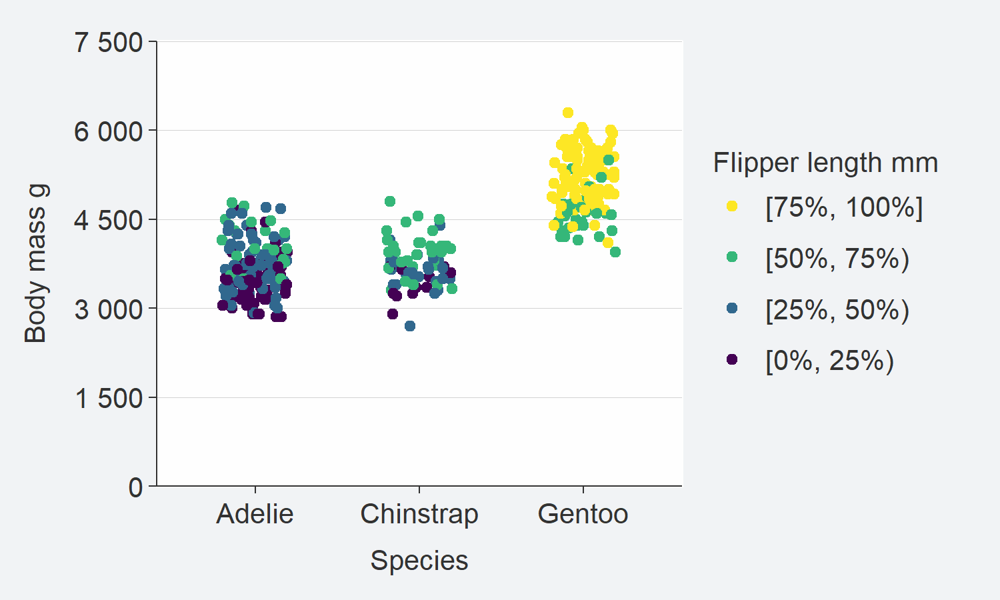

#### 7. {ggblanket} uses nice numeric/date default scales.

Where x variable is categorical and y numeric, the numeric y scale
defaults to the limits being the min and max of the *breaks*, with
expand of c(0, 0). Equivalent happens for the horizontal vice versa
situation.

Where both x and y are numeric/date, the y scale defaults to the limits
being the min and max of the *breaks* with expand of c(0, 0) - and x
scales default to the min and max of the *variable* with expand of
`c(0.025, 0.025)`.

These defaults look good with the default theme.

``` r
storms %>%
  group_by(year) %>%
  filter(between(year, 1980, 2020)) %>%
  summarise(wind = mean(wind, na.rm = TRUE)) %>%
  gg_line(
    x = year,
    y = wind,
    x_labels = ~.x,
    y_include = 0,
    title = "Storm wind speed",
    subtitle = "USA average storm wind speed, 1980\u20132020",
    y_title = "Wind speed (knots)",
    caption = "Source: NOAA"
  ) +
  geom_point()
```

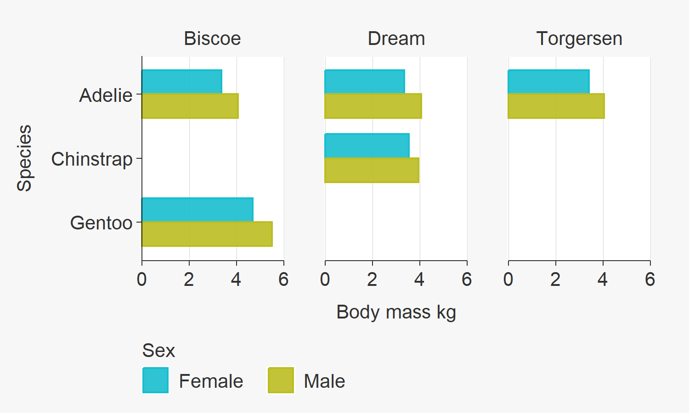

#### 8. {ggblanket} provides a `theme` argument for customisation.

This allows you to utilise the simplicity of {ggblanket}, while making
content that has your required look and feel.

Your theme will control all theme aspects, other than the legend
position and direction. You must instead control these within the `gg_*`
function with the `col_legend_place` argument
(e.g. \``col_legend_place = "r"`).

``` r
penguins %>%
  mutate(sex = stringr::str_to_sentence(sex)) %>% 
  gg_point(x = bill_depth_mm,
           y = bill_length_mm,
           col = sex,
           facet = species, 
           pal = c("#1B9E77", "#9E361B"), 
           theme = theme_grey())
```

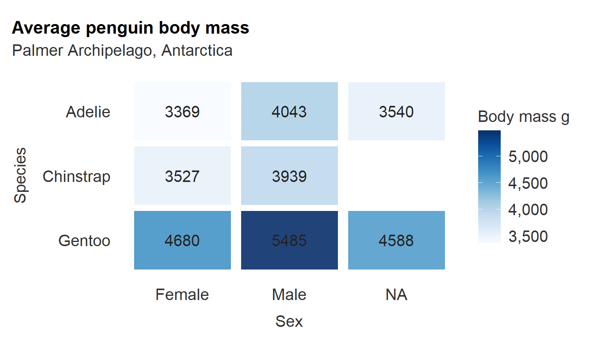

#### 9. {ggblanket} provides a `gg_theme` function to create a quick theme.

The `gg_theme` function allows you to create a theme that looks similar
to the {ggblanket} look and feel.

This includes the following arguments for adjusting gridlines,
background colours, text and axis lines and ticks.

``` r
storms %>%
  group_by(year) %>%
  filter(between(year, 1980, 2020)) %>%
  summarise(wind = mean(wind, na.rm = TRUE)) %>%
  gg_col(
    x = year,
    y = wind,
    x_labels = ~.x,
    x_expand = c(0, 0),
    theme = gg_theme(
      bg_plot_pal = "white",
      bg_panel_pal = "white",
      grid_h = TRUE))
```

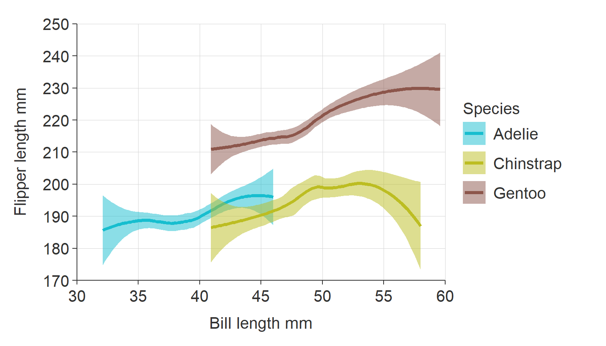

#### 10. {ggblanket} arranges horizontal plot labels to be in correct order.

When plots are horizontal, {ggblanket} ensures y labels and colours are
in the right order.

``` r
penguins %>%
  tidyr::drop_na(sex) %>% 
  group_by(species, sex, island) %>%
  summarise(body_mass_kg = mean(body_mass_g) / 1000) %>%
  gg_col(
    x = body_mass_kg, 
    y = species, 
    col = sex, 
    facet = island,
    col_labels = snakecase::to_sentence_case, 
    position = "dodge")
```

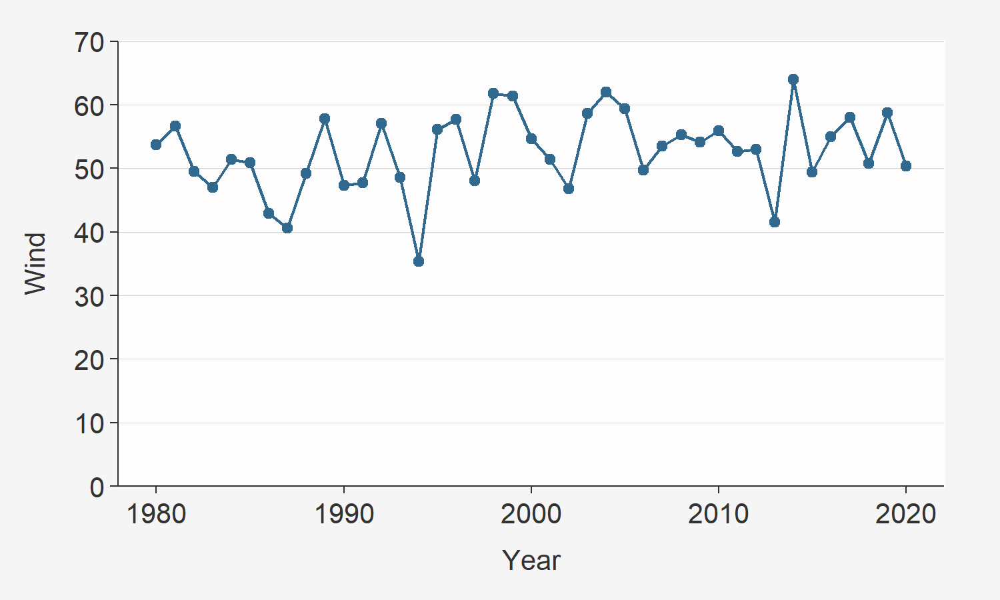

#### 11. {ggblanket} defaults to converting unspecified titles to snakecase::to_sentence.

This will make quicker to get to a plot that has titles that are good
for external people to see, and will often work nicely for your
`snakecase` column names.

For titles that you need to change manually, you can change manually
using `x_title`, `y_title`, or `col_title`.

You can also use `titles = ~.x` to leave unspecified titles as per
variable names.

``` r
penguins %>%
  group_by(species, sex) %>%
  summarise(across(body_mass_g, ~ round(mean(.x, na.rm = TRUE)), 0)) %>% 
  gg_tile(
    x = sex, 
    y = species, 
    col = body_mass_g, 
    x_labels = snakecase::to_sentence_case,
    pal = pals::brewer.blues(9), 
    width = 0.9,
    height = 0.9,
    col_legend_place = "r",
    title = "Average penguin body mass",
    subtitle = "Palmer Archipelago, Antarctica",
    theme = gg_theme(grid_h = FALSE,
                     bg_plot_pal = "white",
                     axis_pal = "white", 
                     ticks_pal = "white")) +
  geom_text(aes(label = body_mass_g), col = "#232323", size = 3.5) 
```

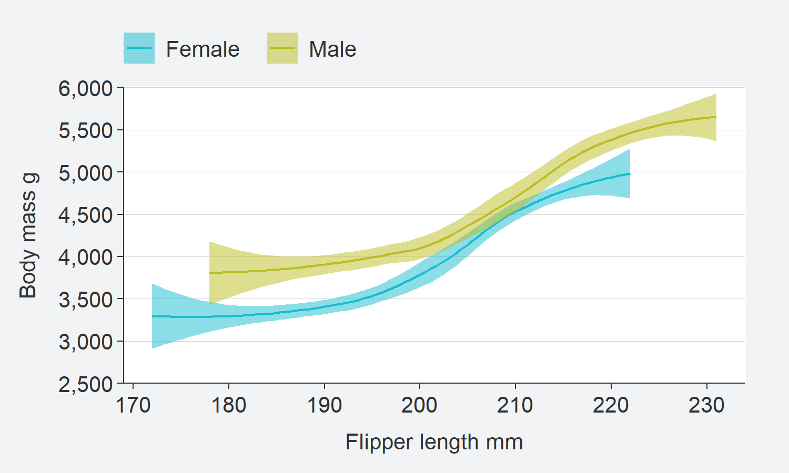

#### 12. {ggblanket} provides a `gg_blank` function for extra flexibility.

This function means is useful where you want to use non-supported
geom’s, aesthetics or if you want to add subsequent layers.

``` r
penguins %>%
  tidyr::drop_na(sex) %>%
  mutate(sex = stringr::str_to_sentence(sex)) %>%
  group_by(species, sex) %>%
  summarise(
    mean = round(mean(bill_length_mm, na.rm = TRUE), 0),
    n = n(),
    se = mean / sqrt(n),
    upper = mean + 1.96 * se,
    lower = mean - 1.96 * se
  ) %>%
  gg_blank(
    x = sex,
    y = mean,
    col = sex,
    facet = species,
    label = mean,
    ymin = lower,
    ymax = upper,
    y_include = 0,
    y_title = "Bill length mm"
  ) +
  geom_col(width = 0.75, alpha = 0.9) +
  geom_errorbar(width = 0.1, colour = pal_na()) 
```

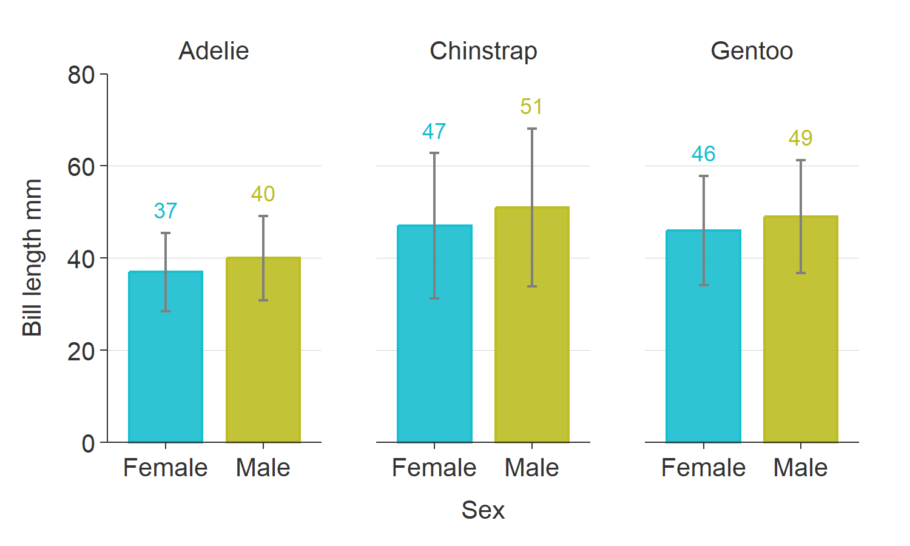

#### 13. {ggblanket} supports nice `plotly::ggplotly` tooltips.

The `add_tooltip` function allows users to create nice tooltips in
combination with the `text` argument, and the `tooltip = "text"`
argument in `ggplotly`.

``` r
theme_custom <- gg_theme(
  "helvetica",
  bg_plot_pal = "white",
  bg_panel_pal = "white",
  grid_h = TRUE
)

iris %>% 
  mutate(Species = stringr::str_to_sentence(Species)) %>% 
  add_tooltip_text(titles = snakecase::to_sentence_case) %>% 
  gg_point(
    x = Sepal.Width, 
    y = Sepal.Length, 
    col = Species, 
    text = text, 
    col_legend_place = "r",
    theme = theme_custom) %>% 
  plotly::ggplotly(tooltip = "text")
```

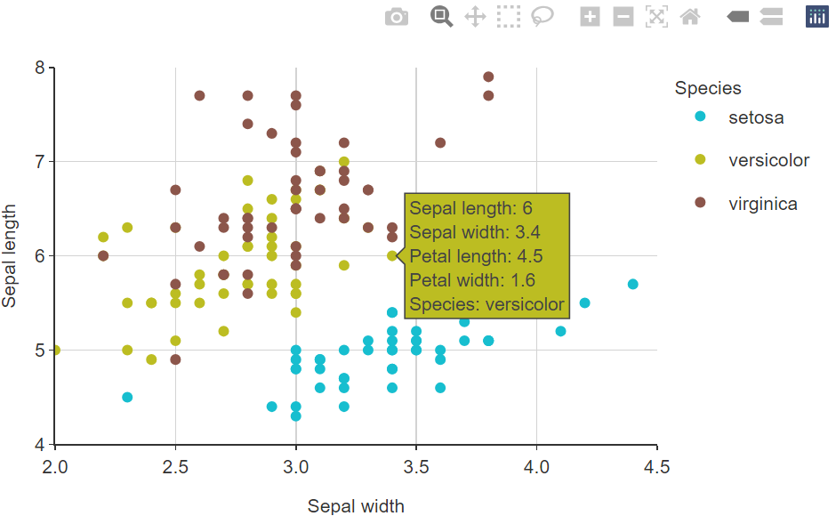

#### 14. {ggblanket} provides access to all other `geom_*` arguments via `...`

This relates to all other arguments other than the mapping argument with
aesthetics.

``` r
penguins %>%
  tidyr::drop_na(sex) %>%
  gg_smooth(
    x = flipper_length_mm,
    y = body_mass_g,
    col = sex,
    level = 0.99, #argument from geom_smooth
    col_legend_place = "t",
    col_title = "", 
    col_labels = snakecase::to_sentence_case
  ) 
```

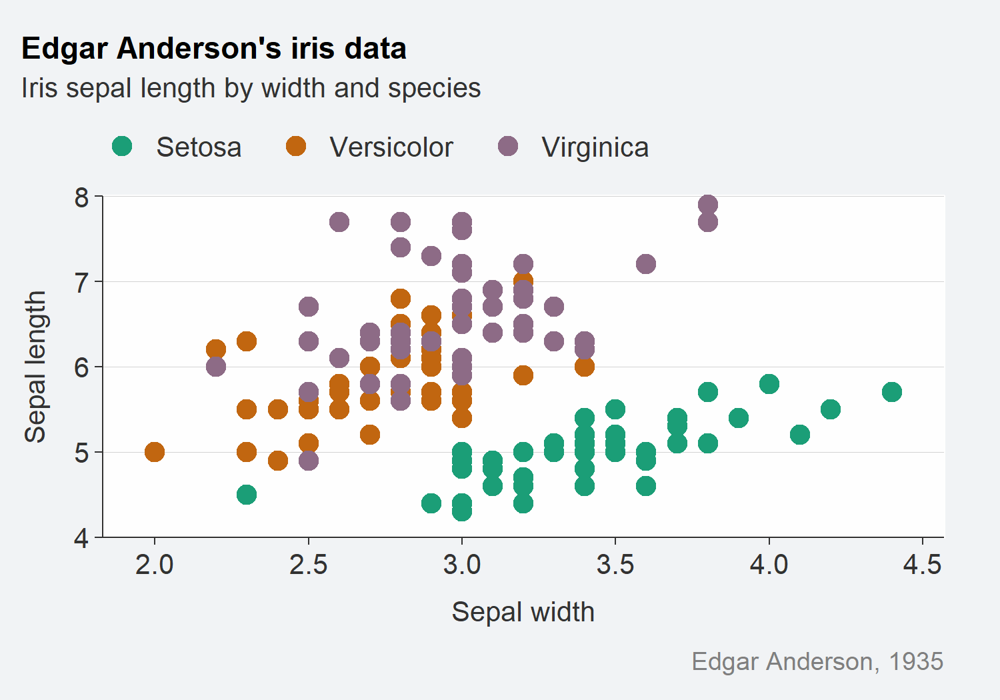

#### 15. {ggblanket} is useful for creating customised functions with your own defaults.

This is because the `...` argument can allow you to access *all*
arguments within the {ggblanket} `gg_` function.

``` r
gg_point_custom <- function(data, x, y, col, 
                            size = 3, 
                            pal = pals::brewer.dark2(9), 
                            col_title = "", 
                            col_legend_place = "t",
                            ...) {
  data %>% 
    gg_point(x = {{ x }}, y = {{ y }}, col = {{col}}, 
             size = size, 
             pal = pal, 
             col_title = col_title, 
             col_legend_place = col_legend_place, 
             ...)
}

iris %>%
  mutate(Species = stringr::str_to_sentence(Species)) %>% 
  gg_point_custom(
    x = Sepal.Width,
    y = Sepal.Length,
    col = Species, 
    title = "Edgar Anderson's iris data",
    subtitle = "Iris sepal length by width and species",
    caption = "Edgar Anderson, 1935"
  )
```

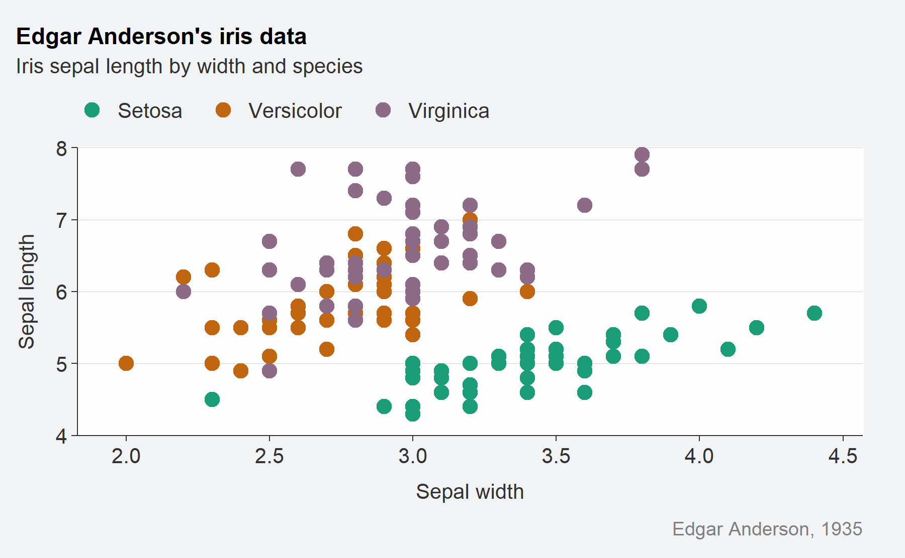
