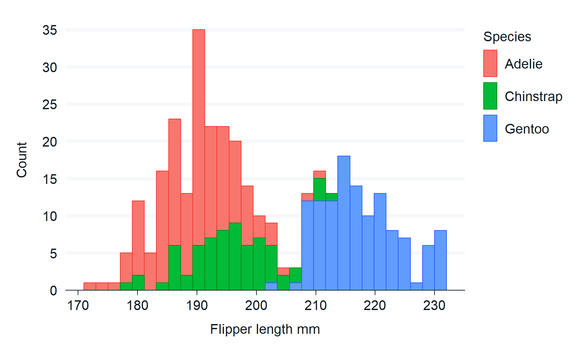

<!-- README.md is generated from README.Rmd. Please edit that file -->

# ggblanket 

<!-- badges: start -->

[](https://CRAN.R-project.org/package=ggblanket)
[](https://r-pkg.org/pkg/ggblanket)
[](https://r-pkg.org/pkg/ggblanket)
[](https://r-pkg.org/pkg/ggblanket)
[](https://r-pkg.org/pkg/ggblanket)
<!-- badges: end -->

## Overview

ggblanket is a package of wrapper functions around the fantastic ggplot2
package.

The primary objective is to **simplify ggplot2 visualisation**.

Secondary objectives relate to:

- Scope: cover the most useful 80% of what ggplot2 does
- Design: produce well-designed visualisation by default
- Alignment: use conventions generally aligned with ggplot2.

It is intended to be useful for all levels of experience from beginner
to expert.

## Website

Click
[here](https://davidhodge931.github.io/ggblanket/articles/ggblanket.html)
to get started learning how ggblanket works.

## Installation

``` r
install.packages("ggblanket")
```

## Examples

``` r
library(dplyr)
library(ggplot2)
library(ggblanket)
library(palmerpenguins)

penguins <- penguins |>
  mutate(sex = stringr::str_to_sentence(sex)) |>
  tidyr::drop_na(sex)
```

``` r
penguins |>
  gg_point(
    x = flipper_length_mm,
    y = body_mass_g, 
    col = species)
```

 <br>
<br>

``` r
penguins |>
  gg_histogram(
    x = bill_depth_mm,
    col = sex,
    facet = species)
```


## Thanks!

Thank you to all authors and contributors to ggplot2, tidyverse, and the
wider R ecosystem. If you like ggblanket, please give the repository a
star and help spread the word.
