# Extensions

## Overview

This article will demonstrate some fantastic ggplot2 extension packages.

Note, an alternative is to use ggplot2 code directly instead. This may
be easier depending on your familiarity with ggblanket/ggplot2 and the
relevant extension package. The
[`set_blanket()`](https://davidhodge931.github.io/ggblanket/reference/set_blanket.md)
function used to get a lot of the ggblanket style also works with
ggplot2.

``` r
library(dplyr)
library(stringr)
library(ggplot2)
library(scales)
library(ggblanket)
library(patchwork)
library(palmerpenguins)

set_blanket()

penguins2 <- penguins |> 
  labelled::set_variable_labels(
    bill_length_mm = "Bill length (mm)",
    bill_depth_mm = "Bill depth (mm)",
    flipper_length_mm = "Flipper length (mm)",
    body_mass_g = "Body mass (g)",
  ) |> 
  mutate(sex = stringr::str_to_sentence(sex))  
```

### patchwork

The patchwork package enables plots to be patched together.

A convenient hack to add a panel centred title can be to add a
`facet_wrap` layer with a character title string for the `facets`
argument.

Otherwise you will need to modify margins

``` r
p1 <- mtcars |> 
  gg_point(
    x = mpg, 
    y = disp,
  ) +
  facet_wrap(~"Plot 1")

p2 <- mtcars |> 
  gg_boxplot(
    x = gear, 
    y = disp, 
    group = gear, 
    width = 0.5,
  ) +
  facet_wrap(~"Plot 2")

p3 <- mtcars |> 
  gg_smooth(
    x = disp, 
    y = qsec, 
  ) +
  facet_wrap(~"Plot 3")

(p1 + p2) / p3 +
  plot_annotation(
    title = "A collection of plots patched together",
    subtitle = "Works so nice!",
    theme = light_mode_r() +
      theme(
        plot.title = element_text(margin = margin(t = -11)),
        plot.subtitle = element_text(margin = margin(t = 5.5)),
      )
  )
```

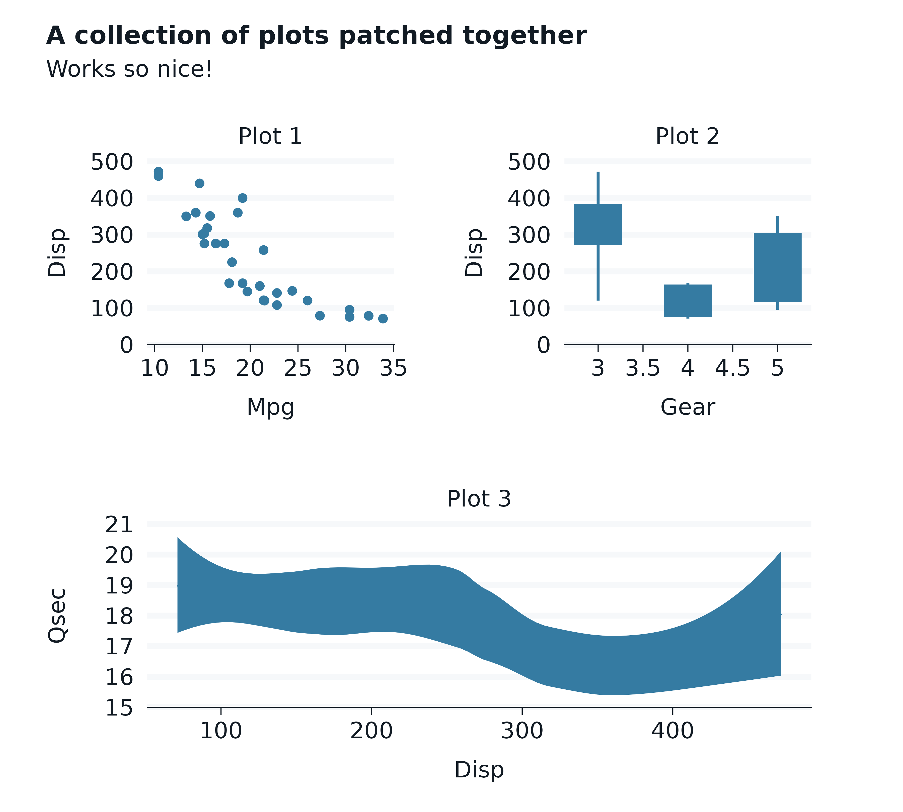

### marquee

The marquee package supports using markdown in text.

``` r
penguins2 |>
  gg_point(
    x = bill_depth_mm,
    y = bill_length_mm,
    col = species,
    title = "**{.#0095a8ff Adelie}**, **{.#ffa600ff Chinstrap}**, *and* 
    **{.#003f5cff Gentoo}** penguin species",
  ) +
  theme(legend.position = "none") +
  theme(plot.title = marquee::element_marquee()) 
```

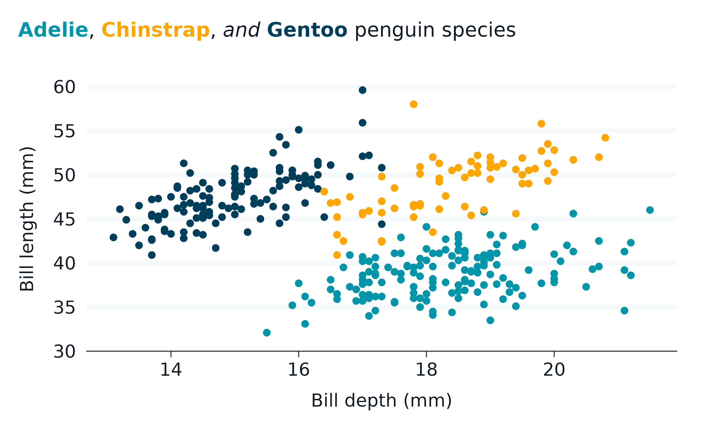

### showtext

The showtext package enables the use of different fonts in plots. The
`*_mode_*` theme functions provide a `base_family` argument.

``` r
head(sysfonts::font_families_google())
#> [1] "ABeeZee"       "ADLaM Display" "AR One Sans"   "Abel"         
#> [5] "Abhaya Libre"  "Aboreto"

#register google fonts
sysfonts::font_add_google(name = "Covered By Your Grace", family = "grace")
sysfonts::font_add_google(name = 'Roboto Slab', family = 'roboto_slab')
sysfonts::font_add_google(name = 'Syne Mono', family = 'syne')

#or download, extract install, and register one from somewhere else
# sysfonts::font_add(family = "blah", regular = "blah1.otf", bold = "blah2.otf")

showtext::showtext_auto(enable = TRUE)

penguins2 |>
  gg_point(
    x = flipper_length_mm,
    y = body_mass_g,
    col = sex,
    facet = species,
    title = "penguins2 body mass by flipper length",
    subtitle = "Palmer Archipelago, Antarctica",
    caption = "Source: Gorman, 2020",
    theme = light_mode_r(base_family = "grace"),
  ) +
  theme(
    plot.title = element_text(family = "roboto_slab"),
    plot.subtitle = element_text(family = "syne")
  )
```

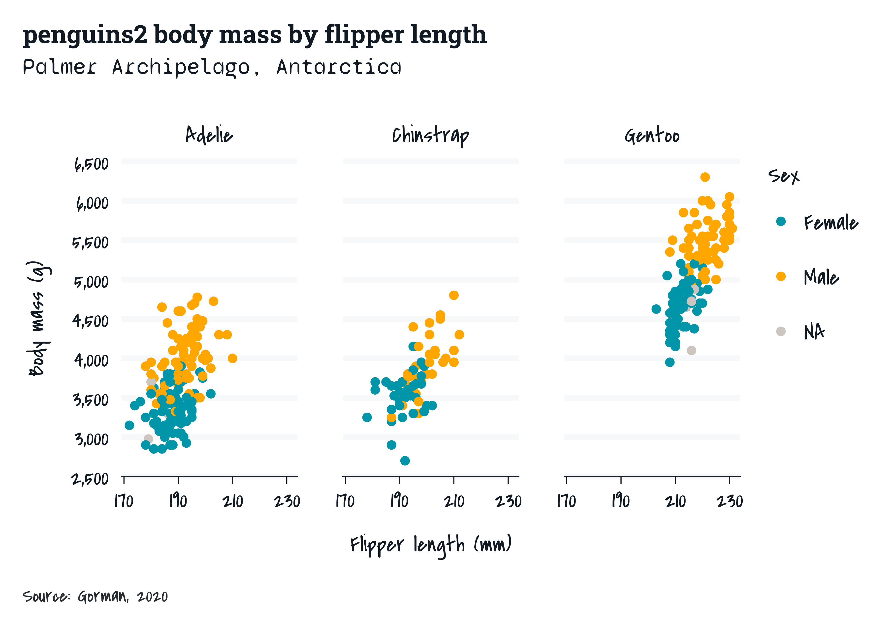

``` r

showtext::showtext_auto(enable = FALSE)
```

### gghighlight

The gghighlight package enables geoms or parts thereof to be
highlighted.

``` r
penguins2 |>
  gg_point(
    x = flipper_length_mm,
    y = body_mass_g,
  ) +
  gghighlight::gghighlight(body_mass_g >= 5000)
```

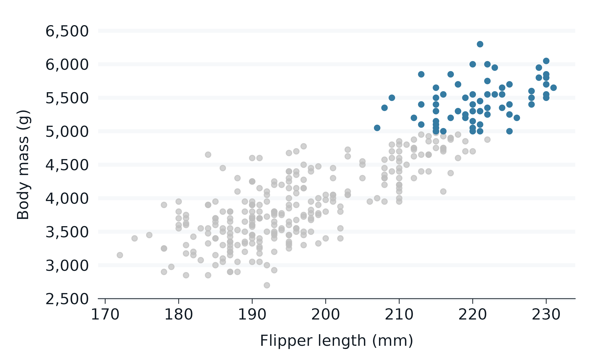

The `gg_*` function builds the scale for the data that it thinks will be
within the panel. Therefore in some situations, this must be taken into
account to ensure the scale builds correctly.

``` r
penguins2 |>
  gg_histogram(
    x = flipper_length_mm,
    col = species,
    x_breaks_n = 4,
  ) + #build the scale for all data
  facet_wrap(~species) + #then add facet layer
  gghighlight::gghighlight() 
```

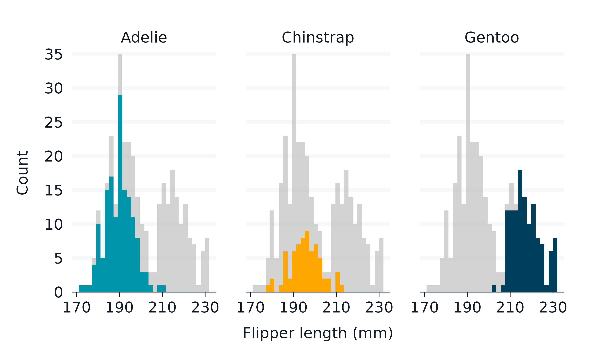

### ggforce

The ggforce package includes numerous extra geoms, stats etc.

``` r
library(ggforce)
geom_bspline()
#> geom_path: arrow = NULL, lineend = butt, na.rm = FALSE
#> stat_bspline: na.rm = FALSE, n = 100, type = clamped
#> position_identity

economics |>
  slice_head(n = 35) |> 
  gg_path(
    stat = "bspline", n = 100, type = "clamped",
    x = date, 
    y = unemploy,
    linewidth = 1,
    y_label = "Unemployment",
  ) 
```

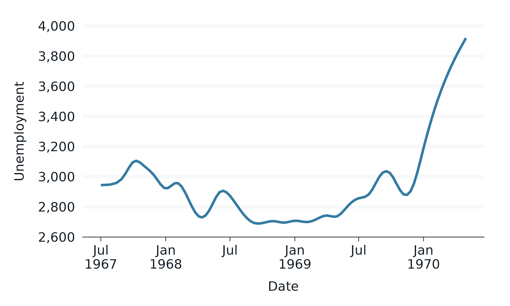

``` r
geom_mark_hull()
#> geom_mark_hull: na.rm = FALSE, expand = 5, radius = 2.5, concavity = 2, label.margin = c(2, 2, 2, 2), label.width = NULL, label.minwidth = 50, label.fontsize = 12, label.family = , label.lineheight = 1, label.fontface = c("bold", "plain"), label.hjust = 0, label.fill = white, label.colour = black, label.buffer = 10, con.colour = black, con.size = 0.5, con.type = elbow, con.linetype = 1, con.border = one, con.cap = 3, con.arrow = NULL
#> stat_identity: na.rm = FALSE
#> position_identity

penguins2 |>
  gg_blanket(
    geom = "mark_hull",
    x = flipper_length_mm,
    y = body_mass_g,
    col = species,
    coord = coord_cartesian(),
  ) +
  geom_point()
```

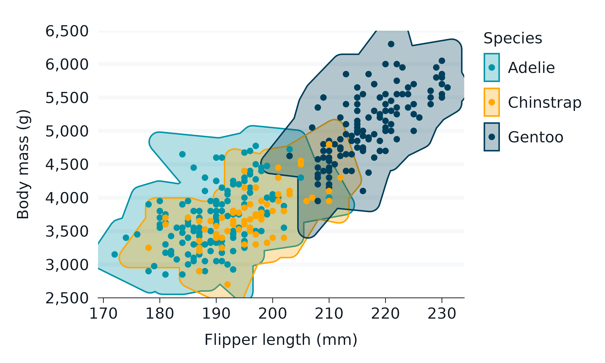

### ggrepel

The ggrepel package can be used to neatly avoid overlapping labels.

``` r
library(ggrepel)
geom_text_repel()
#> geom_text_repel: parse = FALSE, na.rm = FALSE, box.padding = 0.25, point.padding = 1e-06, min.segment.length = 0.5, arrow = NULL, force = 1, force_pull = 1, max.time = 0.5, max.iter = 10000, max.overlaps = 10, nudge_x = 0, nudge_y = 0, xlim = c(NA, NA), ylim = c(NA, NA), direction = both, seed = NA, verbose = FALSE
#> stat_identity: na.rm = FALSE
#> position_identity

mtcars |>
  tibble::rownames_to_column("car") |>
  filter(wt > 2.75, wt < 3.45) |>
  gg_point(
    x = wt, 
    y = mpg, 
    label = car, 
  ) +
  geom_text_repel() 
```

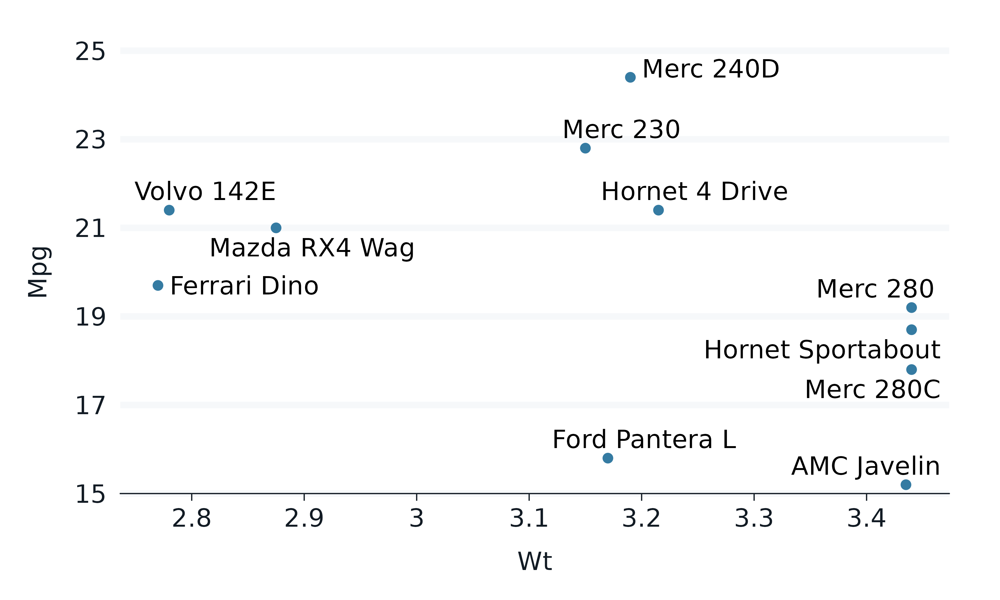

### ggbeeswarm

The ggbeeswarm package enables beeswarm plots.

``` r
library(ggbeeswarm)
geom_beeswarm()
#> geom_point: na.rm = FALSE
#> stat_identity: na.rm = FALSE
#> position_beeswarm
geom_quasirandom()
#> geom_point: na.rm = FALSE
#> stat_identity: na.rm = FALSE
#> position_quasirandom

p1 <- penguins2 |> 
  gg_point(
    position = position_beeswarm(),
    x = sex, 
    y = flipper_length_mm,
    col = sex,
    x_labels = \(x) str_to_upper(str_sub(x, 1, 1)),
    subtitle = "\nBeeswarm",
  ) +
  theme(legend.position = "none")

p2 <- penguins2 |> 
  gg_point(
    position = ggbeeswarm::position_quasirandom(),
    x = sex, 
    y = flipper_length_mm,
    col = sex,
    x_labels = \(x) str_to_upper(str_sub(x, 1, 1)),
    subtitle = "\nQuasirandom",
  ) +
  theme(legend.position = "none")

p1 + p2
```

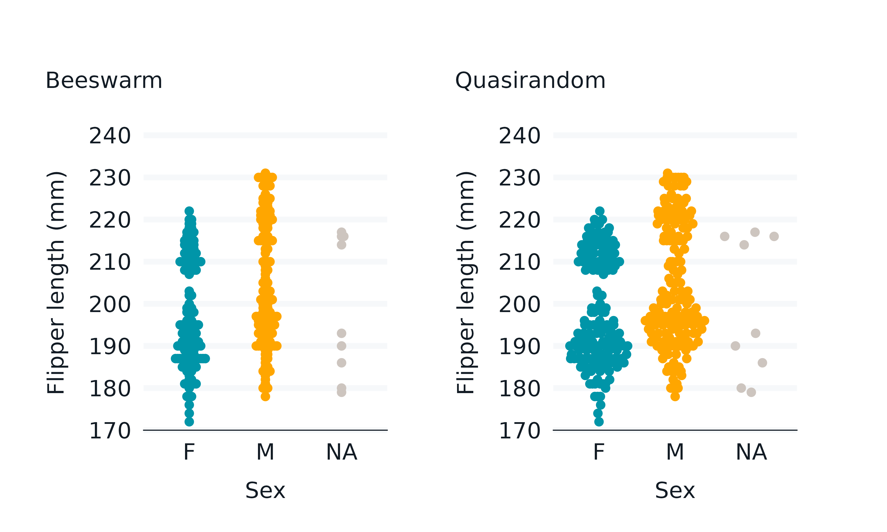

### ggridges

The ggridges package enables ridgeline plots.

``` r
library(ggridges)
geom_density_ridges()
#> geom_density_ridges: na.rm = FALSE, panel_scaling = TRUE
#> stat_density_ridges: na.rm = FALSE
#> position_points_sina

ggridges::Catalan_elections |>
  rename_with(snakecase::to_snake_case) |>
  mutate(year = factor(year)) |>
  gg_blanket(
    geom = "density_ridges",
    stat = "density_ridges",
    coord = coord_cartesian(xlim = c(0, 100)),
    x = percent,
    y = year,
    col = option,
    colour = "white",
    y_expand = expansion(c(0, 0.125)),
    alpha = 0.9,
  )
```

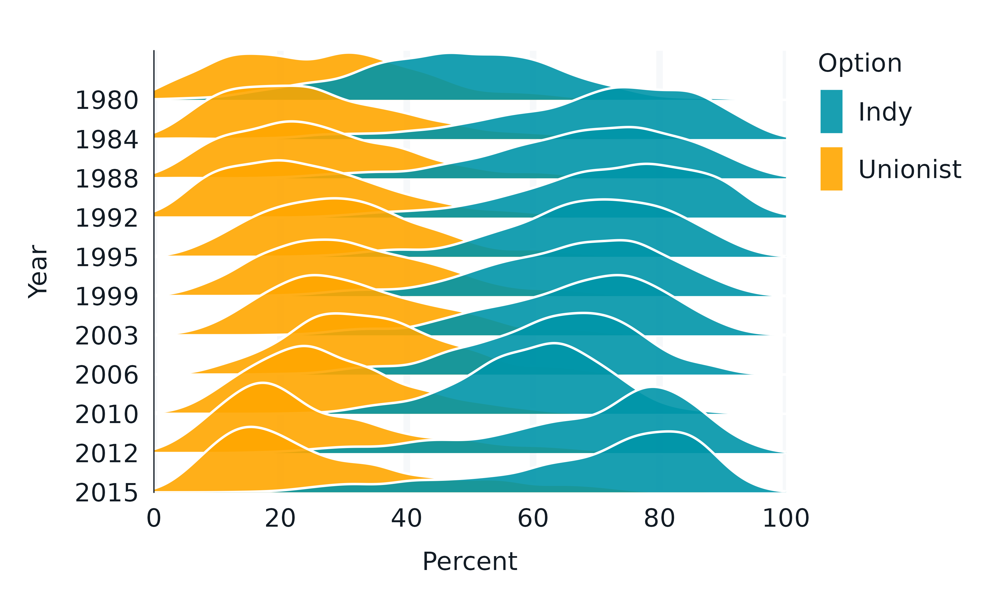

### ggdist

The ggdist package supports the visualisation of uncertainty.

``` r
library(ggdist)
library(distributional)
geom_slabinterval()
#> geom_slabinterval: orientation = NA, subscale = thickness, normalize = all, fill_type = segments, interval_size_domain = c(1, 6), interval_size_range = c(0.6, 1.4), fatten_point = 1.8, arrow = NULL, show_slab = TRUE, show_point = TRUE, show_interval = TRUE, subguide = slab, na.rm = FALSE
#> stat_identity: na.rm = FALSE
#> position_identity

set.seed(123)

data.frame(
  distribution = c("Gamma(2,1)", "Normal(5,1)", "Mixture"),
  values = c(
    dist_gamma(2, 1),
    dist_normal(5, 1),
    dist_mixture(
      dist_gamma(2, 1),
      dist_normal(5, 1),
      weights = c(0.4, 0.6))
  )) |> 
  gg_blanket(
    geom = "slabinterval",
    stat = "slabinterval",
    y = distribution,
    mapping = aes(dist = values),
    # colour = lightness[1],
    blend = "multiply",
    # fill = blue,
    y_expand = c(0.05, 0.05),
    # show_slab = FALSE,
    # show_interval = FALSE,
  ) +
  theme(legend.position = "none")
```

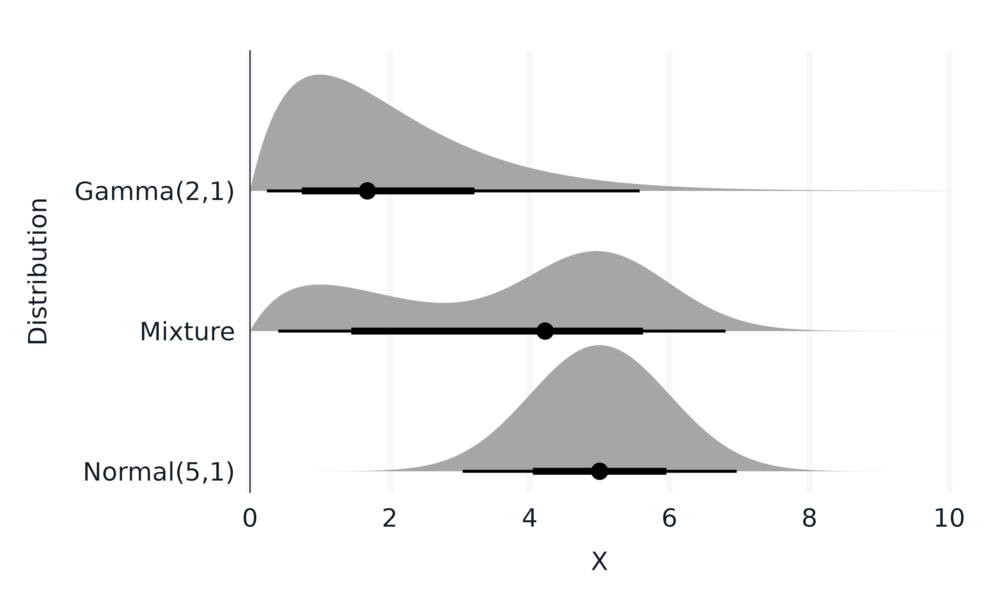

### ggdensity

The ggdensity package provides visualizations of density estimates.

``` r
library(ggdensity)
geom_hdr()
#> geom_hdr: na.rm = FALSE
#> stat_hdr: na.rm = FALSE
#> position_identity

set.seed(123)

data.frame(
  x = rnorm(1000),
  y = rnorm(1000),
  z = c(rep("A", times = 500), rep("B", times = 500))
) |>
  gg_blanket(
    geom = "hdr", 
    stat = "hdr",
    x = x, 
    y = y, 
    y_symmetric = FALSE,
  ) 
```

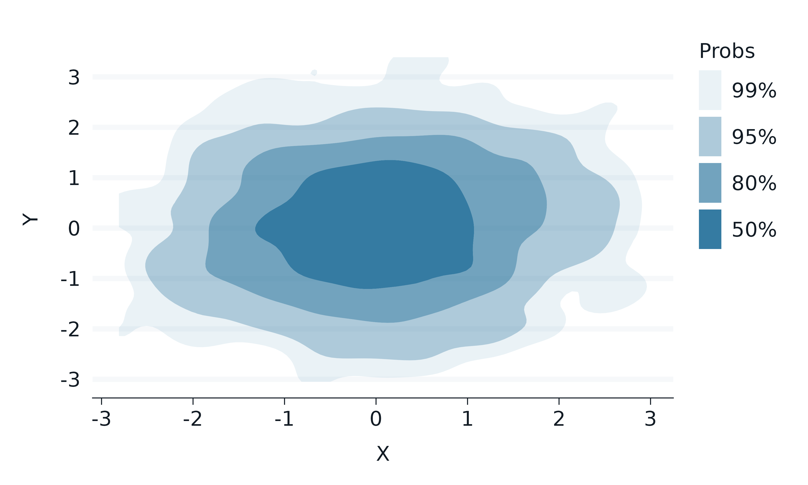

``` r
set.seed(123)

data.frame(
  x = rnorm(1000),
  y = rnorm(1000),
  z = c(rep("A", times = 500), rep("B", times = 500))
) |>
  gg_blanket(
    geom = "hdr", 
    stat = "hdr",
    x = x, 
    y = y, 
    col = z,
    facet = z,
    y_symmetric = FALSE,
  ) 
```

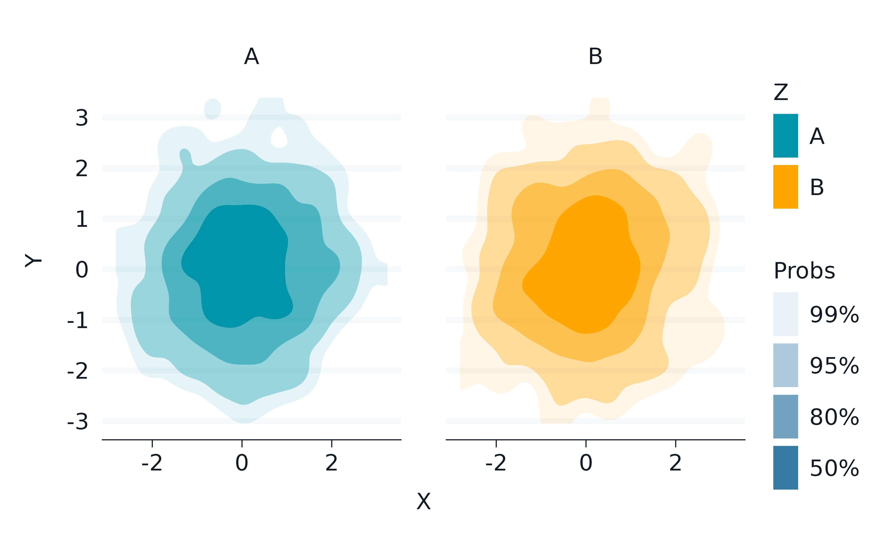

### ggpattern

``` r
library(ggpattern)

penguins2 |>
  group_by(species, sex) |>
  summarise(across(body_mass_g, \(x) mean(x))) |>
  tidyr::drop_na() |> 
  labelled::copy_labels_from(penguins2) |> 
  gg_blanket(
    geom = "col_pattern",
    position = "dodge",
    y = species,
    x = body_mass_g,
    col = sex,
    mapping = aes(pattern = sex),
    width = 0.75,
  ) 
```

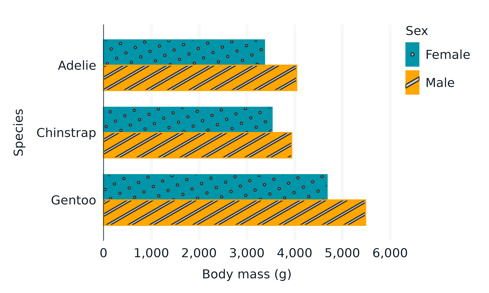

### paletteer

The paletteer package provides access to most of the palettes within R.

``` r
library(paletteer)

p1 <- penguins2 |>
  gg_point(
    x = flipper_length_mm,
    y = body_mass_g,
    col = species,
    col_palette = paletteer_d("RColorBrewer::Dark2"),
    x_breaks_n = 4,
  ) +
  theme(legend.position = "none")

p2 <- penguins2 |>
  gg_point(
    x = flipper_length_mm,
    y = body_mass_g,
    col = bill_depth_mm,
    col_palette = paletteer_c("viridis::rocket", 9),
    x_breaks_n = 4,
  ) +
  theme(legend.position = "none")

p1 + p2
```

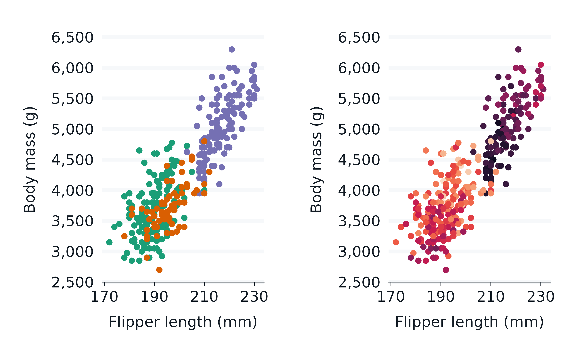

### ggblend

The ggblend package provides blending of colours. You must use a
graphics device that supports blending.

``` r
penguins2 |>
  gg_blanket(
    stat = "density",
    x = flipper_length_mm,
    col = species,
  ) +
  ggblend::blend(geom_density(), blend = "multiply") 
```

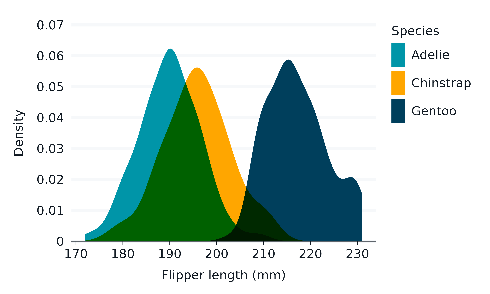

``` r
data.frame(year = 1875:1972, level = as.vector(LakeHuron)) |>
  mutate(level_min = level - 1, level_max = level + 1) |>
  gg_blanket(
    x = year,
    y = level,
    ymin = level_min,
    ymax = level_max,
    x_labels = \(x) x,
  ) +
  ggblend::blend(
    list(geom_ribbon(), geom_line()),
    blend = "multiply",
  )
```

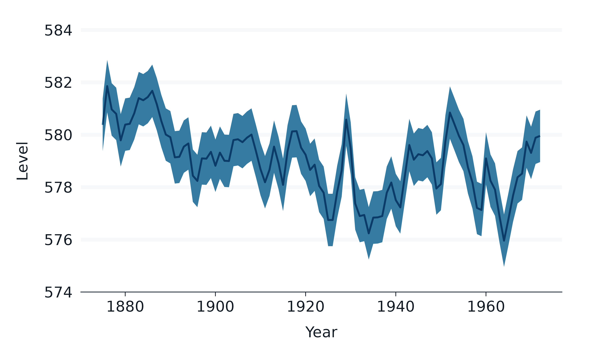

### ggh4x

The ggh4x package includes enhanced facet functionality.

``` r
iris |> 
  rename_with(\(x) snakecase::to_snake_case(x)) |> 
  mutate(across(species, \(x) str_to_sentence(x))) |> 
  mutate(size = if_else(species == "Setosa", "Short Leaves", "Long Leaves")) |> 
  gg_point(
    x = sepal_width, 
    y = sepal_length, 
    x_breaks_n = 4,
  ) +
  ggh4x::facet_nested(
    cols = vars(size, species), 
    nest_line = TRUE, 
    solo_line = TRUE,
  ) +
  theme(strip.text.x = element_text(margin = margin(t = 2.5, b = 5)))
```

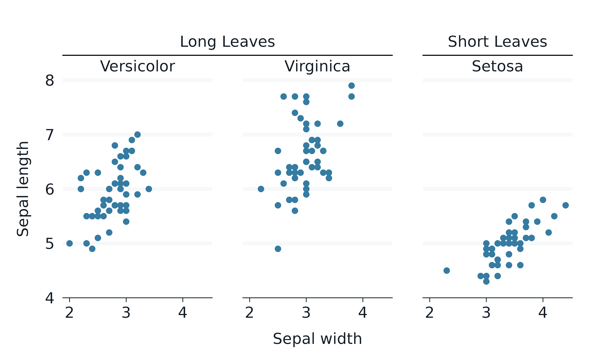

### ggeasy

The ggeasy package provides a lot of support for easily modifying
themes. Removing axes and gridlines is often useful.

``` r
library(ggeasy)

penguins2 |>
  gg_jitter(
    x = species, 
    y = body_mass_g, 
    col = sex, 
  ) +
  light_mode_t() +
  easy_remove_y_gridlines() +
  easy_remove_x_axis(what = c("line", "ticks")) +
  easy_remove_legend_title()
```

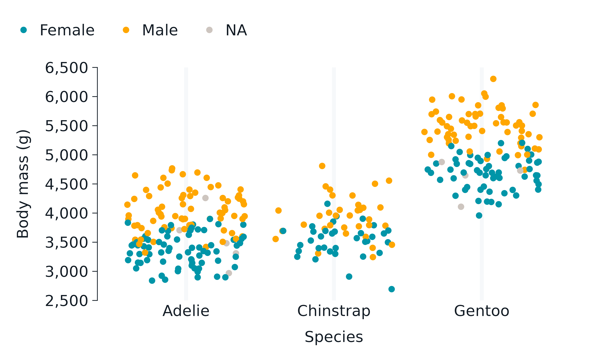
