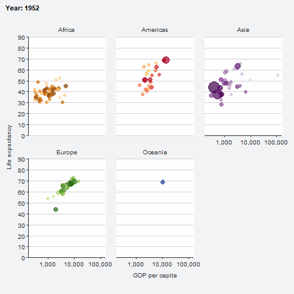

```{r, include = FALSE}
knitr::opts_chunk$set(
  collapse = TRUE,
  comment = "#>",
  message = FALSE,
  warning = FALSE,
  fig.width = 6,
  fig.asp = 0.618,
  out.width = "70%",
  dpi = 300,
  dev.args = list(png = list(type = "cairo")),
  fig.retina = 2
  )
```

## Overview

To extend ggblanket further, users can:

1. Use the ggblank function
2. Work with non-default stat's
3. Use non-supported aesthetics
4. Use non-supported arguments
5. Use non-supported geoms
6. Create custom wrapper functions
7. Work with extension packages 

* patchwork
* ggtext
* gghighlight
* ggrepel
* ggdensity
* ggblend
* ggridges
* plotly::ggplotly
* ggiraph
* gganimate

```{r setup}
library(dplyr)
library(stringr)
library(ggplot2)
library(ggblanket)
library(palmerpenguins)
library(patchwork)

penguins <- penguins |>
  mutate(sex = str_to_sentence(sex)) |>
  tidyr::drop_na(sex)
```

### 1. Use the ggblank function

The `ggblank` function is the most flexible function in ggblanket.

It provides access to the most aesthetics. It provides lots of flexibility to use ggblanket with ggplot2 layers and other extension packages. 

Remember the `gg_*` function builds the x and y scales based on the `data`, `stat`, `x`, and `y` in the `gg_*` function - but these can be adjusted using the `facet_scales`, `*_include` and `*_limits` arguments. The plot scales are constructed without knowledge of subsequent layers. 

So with `ggblank`, you _must_ include the ggplot2 stat in the gg_blank function where it deviates from `"identity"`.     

```{r}
penguins |>
  gg_blank(
    x = body_mass_g, 
    stat = "density") +
  geom_density(col = pal_blue, fill = pal_blue, alpha = 0.9)
```

```{r}
penguins |>
  gg_blank(
    x = body_mass_g, 
    stat = "bin") +
  geom_histogram(col = pal_blue, fill = pal_blue, alpha = 0.9)
```

### 2. Work with non-default stats

Users can change the default stat. The ... argument provides access to the relevant `stat_*` function as well as the `geom_*` function. ggblanket limits the aesthetics available in each `gg_*` function to what is required. 

```{r}
penguins |>
  gg_errorbar(
    x = body_mass_g,
    y = species,
    stat = "summary",
    fun.data = \(x) mean_se(x, 1.96),
    width = 0.25,
    x_include = 0
  ) +
  geom_bar(
    stat = "summary",
    fun = \(x) mean(x),
    alpha = 0.2,
    width = 0.75)
```

### 3. Use non-supported ggplot2 aesthetics

While aesthetics other than col/fill are not supported by ggblanket, it is possible to access these in plots made with a combination of `gg_blank` and other ggplot2 code.

```{r}
#for discrete non-col aesthetic & col aesthetic
penguins |>
  gg_blank(
    x = flipper_length_mm,
    y = body_mass_g, 
    col = sex) + 
  geom_point(aes(shape = sex)) +  
  labs(shape = "Sex") 
```

```{r}
#for discrete non-col aesthetic & no col aesthetic
penguins |>
  gg_blank(
    x = flipper_length_mm,
    y = body_mass_g, 
    col = sex) + #just to make legend on bottom
  geom_point(aes(shape = sex), colour = "#2B6999") + 
  labs(shape = "Sex") 
```

```{r}
#for continuous non-col aesthetic & col aesthetic
penguins |>
  gg_blank(
    x = flipper_length_mm,
    y = body_mass_g, 
    col = species,
    col_legend_place = "r") + 
  geom_point(aes(size = bill_depth_mm)) +
  labs(size = "Bill depth mm") +
  theme(legend.title = element_text(margin = margin(t = 10)))
```

```{r}
#for continuous non-col aesthetic & no col aesthetic
penguins |>
  gg_blank(
    x = flipper_length_mm,
    y = body_mass_g) + 
  geom_point(aes(size = bill_depth_mm), colour = "#2B6999") +
  labs(size = "Bill depth mm") 
```

### 4. Use non-supported arguments

The `gg_*` function provides access to all arguments within the `geom_*` function other than the `mapping` argument. It also provides access to most of the useful arguments you might need in the various guide, scale and facet functions etc. However, it does not provide all such arguments. For example, the switch argument within `facet_grid` is not supported. A way to access this functionality is to `+` the `facet_grid(..., switch = "y")` in.

```{r}
penguins |>
  gg_point(
    x = flipper_length_mm, 
    y = body_mass_g,
    col = island,
    facet = species, 
    facet2 = sex
  ) +
  facet_grid(cols = vars(species),
             rows = vars(sex), 
             switch = "y") +
  theme(strip.switch.pad.grid = unit(2, "mm"))
```

### 5. Use non-supported geoms

gblanket does not support _all_ ggplot2 geoms. However, some of these can be accessed via the gg_blank function.

```{r, fig.asp=1}
p1 <- faithful |> 
  gg_blank(x = eruptions, 
           y = waiting, 
           x_breaks = scales::breaks_pretty(3), 
           subtitle = "geom_density_2d") + 
  geom_density2d(aes(col = after_stat(level)),
                 show.legend = FALSE)

p2 <- faithful |>
  gg_blank(x = waiting, 
           y = eruptions, 
           x_breaks = scales::breaks_pretty(3), 
           subtitle = "geom_density_2d_filled") + 
  geom_density_2d_filled(show.legend = FALSE)

p3 <- faithfuld |> 
  gg_blank(x = waiting, 
           y = eruptions, 
           x_breaks = scales::breaks_pretty(3), 
           subtitle = "geom_contour") + 
  geom_contour(aes(z = density, col = after_stat(level)),
               show.legend = FALSE) 

p4 <- faithfuld |> 
  gg_blank(x = waiting, 
           y = eruptions, 
           x_breaks = scales::breaks_pretty(3),
           subtitle = "geom_contour_filled") + 
  geom_contour_filled(aes(z = density), 
                      show.legend = FALSE)

(p1 + p2) / (p3 + p4)
```

### 6. Create custom wrapper functions

You can create powerful custom functions. This is because the `...` argument can allow you to access _all_  arguments within the ggblanket `gg_*` function (and applicable `ggplot2::geom_*` function). 

```{r}
gg_point_custom <- function(data, x, y, col, 
                            size = 3, 
                            shape = 17,
                            pal = RColorBrewer::brewer.pal(8, "Dark2"), 
                            col_title = "", 
                            col_legend_place = "t",
                            ...) {
  data |> 
    gg_point(x = {{ x }}, y = {{ y }}, col = {{col}}, 
             size = size, 
             shape = shape,
             pal = pal, 
             col_title = col_title, 
             col_legend_place = col_legend_place, 
             col_labels = str_to_sentence,
             ...)
}

iris |>
  gg_point_custom(
    x = Sepal.Width,
    y = Sepal.Length,
    col = Species)
```

### 7. Work with extension packages

ggblanket can work with numerous extension packages. 

#### patchwork

The patchwork package enables plots to be patched together.

```{r}
set.seed(123)

p1 <- penguins |>
  gg_jitter(
    x = species,
    y = body_mass_g,
    col = sex, 
    pal = pal_hue[1:2],
    col_legend_ncol = 2,
    col_legend_nrow = 2)

p2 <- penguins |>
  gg_point(
    x = flipper_length_mm,
    y = body_mass_g,
    col = species, 
    pal = pal_hue[3:5],
    y_title = "", 
    y_labels = \(x) str_sub(x, 0, 0), 
    col_legend_ncol = 2,
    col_legend_nrow = 2)

p1 + p2 
```

#### ggtext

The ggtext package enables plot text to use markdown syntax. 

Note if you want to have some or all of a title not bold, then it's important to change the default theme have a plain title. 

```{r}
nc <- sf::st_read(system.file("shape/nc.shp", package = "sf"), quiet = TRUE)

nc |>
  gg_sf(col = AREA,
        pal = RColorBrewer::brewer.pal(9, "Reds"),
        title = "**Bold** or _italics_ or <span style = 'color:red;'>red</span>",
        theme = gg_theme(title_face = "plain")) +
  theme(plot.title = ggtext::element_markdown())
```

#### gghighlight

The gghighlight package enables geoms or parts thereof to be highlighted. 

It should be noted that the `gg_*` function builds the scale for the data that it thinks will be within the panel. Therefore in some situations, you will _need_ to add a `*_limits = c(NA, NA)` argument to make sure that the scale builds to include the full height of the non-highlighted data. 

```{r}
penguins |>
  gg_point(x = flipper_length_mm,
           y = body_mass_g) +
  gghighlight::gghighlight(body_mass_g >= 5000)
```

```{r}
iris |>
  gg_histogram(
    x = Sepal.Length,
    col = Species,
    facet = Species,
    facet_labels = str_to_sentence,
    y_limits = c(NA, NA)
  ) +
  gghighlight::gghighlight()
```

#### ggrepel

The ggrepel package can be used to neatly avoid overlapping labels. 

```{r}
mtcars |> 
  tibble::rownames_to_column("car") |>
  filter(wt > 2.75, wt < 3.45) |> 
  gg_point(x = wt, y = mpg) +
  ggrepel::geom_text_repel(aes(label = car), col = "#2B6999") 
```

#### ggdensity

The ggdensity package provides visualizations of density estimates.  

```{r}
iris |>
  mutate(across(Species, str_to_sentence)) |> 
  gg_blank(
    x = Sepal.Width,
    y = Sepal.Length,
    col = Species,
    facet = Species,
    col_legend_place = "r") +
  ggdensity::geom_hdr(colour = NA) +
  labs(alpha = "Probs") +
  theme(legend.title = element_text(margin = margin(t = 10)))
```

#### ggblend
 
The ggblend package provides blending of discrete colours. 
 
```{r}
set.seed(123)

rbind(
  data.frame(x = rnorm(500, 0), y = rnorm(500, 1), set = "A"), 
  data.frame(x = rnorm(500, 1), y = rnorm(500, 2), set = "B")) |>
  gg_blank(
    x = x,
    y = y,
    col = set,
    pal = RColorBrewer::brewer.pal(9, "Set1")) +
  geom_point(size = 3, alpha = 0.5) |> 
    ggblend::partition(vars(set)) |> 
    ggblend::blend("lighten") +
  geom_point(size = 3, alpha = 0.5) |> 
    ggblend::partition(vars(set)) |> 
    ggblend::blend("multiply", alpha = 0.5) 
```

#### ggridges

The ggridges package enables ridgeline plots. 

```{r}
if (requireNamespace("ggridges", quietly = TRUE)) {

  ggridges::Catalan_elections |>
    rename_with(snakecase::to_snake_case) |> 
    mutate(across(year, factor)) |>
    gg_blank(
      y = year, 
      x = percent, 
      col = option, 
      y_expand = c(0, 0), 
      col_legend_rev = TRUE, 
      pal = pal_hue[c(2, 1)]) +
    ggridges::geom_density_ridges(
      alpha = 0.8, 
      col = "white")
}
```

#### plotly::ggplotly

The plotly::ggplotly function enables interactive plots.

```{r, out.width=500, out.height=300}
p <- diamonds |>
  gg_bar(
    x = color,
    col = color,
    width = 0.75,
    theme = gg_theme("helvetica")) 

plotly::ggplotly(p, tooltip = c("x", "y")) %>% 
    plotly::layout(autosize = F, width = 500, height = 300)
```

#### ggiraph

The ggiraph package enables interactive plots.

```{r}
p <- diamonds |>
  gg_blank(
    x = color,
    col = color,
    width = 0.75,
    y_include = 0,
    stat = "count", 
    theme = gg_theme("helvetica", text_size = 9)) +
  ggiraph::geom_bar_interactive(
    aes(tooltip = after_stat(count), 
        data_id = color), width = 0.75)

ggiraph::girafe(
  ggobj = p, 
  height_svg = 3, 
  width_svg = 5,
  options = list(
    ggiraph::opts_sizing(rescale = TRUE, width = 0.7),
    ggiraph::opts_tooltip(use_fill = TRUE), 
    ggiraph::opts_hover(css = "stroke:black;stroke-width:1px;")))
```

#### gganimate

The gganimate package enables animated plots.

```{r, eval=FALSE}
gapminder::gapminder |> 
  gg_blank(
    x = gdpPercap, 
    y = lifeExp, 
    col = country, 
    facet = continent, 
    x_trans = "log10", 
    pal = country_colors,
    col_legend_place = "n", 
    title = "Year: {frame_time}", 
    x_title = "GDP per capita", 
    y_title = "Life expectancy", 
    y_include = 0) +
  geom_point(aes(size = pop), alpha = 0.7) +
  scale_size(range = c(2, 12)) +
  gganimate::transition_time(year) +
  gganimate::ease_aes("linear")
```
```{r, echo=FALSE}

```

