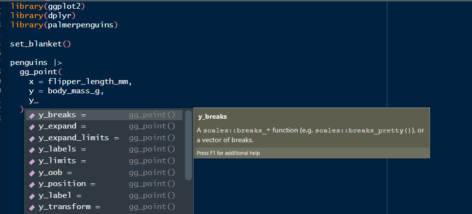

## Overview

ggblanket is a package of ggplot2 wrapper functions.

The primary objective is to **simplify ggplot2 visualisation**.

Secondary objectives relate to:

* Design: produce well-designed visualisation
* Alignment: use conventions aligned with ggplot2
* Scope: cover much of what ggplot2 does.

Computational speed has been traded-off to achieve these objectives.

## How it works
 
1.  Almost forty `gg_*` wrapper functions
2.  A `col` argument to colour and fill by a variable
3.  A `facet` argument to facet by a variable
4.  A `facet2` argument to facet by a 2nd variable
5.  Prefixed arguments to customise x, y, col and facet properties 
6.  Smart defaults for the  `x_label`, `y_label` and `col_label`
7.  Access to other `geom_*` arguments via `...`
8.  A symmetrical continuous scale with easy opt-out
9.  Ability to add multiple `geom_*` layers
10. Access other aesthetics via `mapping`
11. A `mode` argument designed for `*_mode_*` themes
12. Families of `*_mode_*` themes that differ by legend placement 
13. Set the mode and geom defaults with `set_blanket`
14. A `gg_blanket()` function with `geom` flexibility


```r
library(ggblanket)
library(ggplot2)
library(dplyr)
library(stringr)
library(tidyr)
library(palmerpenguins)
library(patchwork)
library(labelled)

set_blanket()

penguins <- penguins |> 
  set_variable_labels(
    bill_length_mm = "Bill length (mm)",
    bill_depth_mm = "Bill depth (mm)",
    flipper_length_mm = "Flipper length (mm)",
    body_mass_g = "Body mass (g)"
  ) |> 
  mutate(sex = factor(sex, labels = c("Female", "Male")))
```
 
### 1. Almost forty `gg_*` wrapper functions

Each `gg_*` function wraps a ggplot2 `ggplot2::ggplot()` function with the applicable ggplot2 `geom_*()` function. 

Each `gg_*` function is named after the `geom_*` function it wraps. 

Note at the start of every script, the `set_blanket` function should be run to set the default style for subsequent ggblanket plots. 


```r
penguins |>
  gg_point(
    x = flipper_length_mm,
    y = body_mass_g,
  )
```


### 2. A single `col` argument to colour and fill by a variable

The colour and fill aesthetics of ggplot2 are merged into a single concept represented by the `col` argument. 

This combined aesthetic means that everything should be coloured according to it, i.e. all coloured outlines and filled interiors. 

Use `colour = NA` or `fill = NA` if you need to turn one of these off.


```r
penguins |>
  gg_point(
    x = flipper_length_mm,
    y = body_mass_g, 
    col = species,
  )
```


```r
penguins |>
  drop_na(sex) |>
  mutate(across(sex, str_to_sentence)) |>
  gg_bar(
    position = "dodge",
    y = species, 
    col = sex,
    width = 0.75,
  )
```


### 3. A `facet` argument to facet by a variable

Faceting is treated as if it were an aesthetic. Users just provide an unquoted variable to facet by. 

When `facet` variable is _not_ NULL (and `facet2 = NULL`), the `facet_layout` will default to `"wrap"`. 


```r
penguins |>
  drop_na(sex) |> 
  mutate(across(sex, str_to_sentence)) |> 
  gg_histogram(
    x = flipper_length_mm,
    facet = species,
  )
```


### 4. A `facet2` argument to facet by a 2nd variable

A `facet2` argument is also provided for extra functionality and flexibility. 

This enables users to facet easily in a `"grid"` layout of the `facet` variable horizontally by the `facet2` variable vertically. 

Whenever a `facet2` does _not_ equal NULL, the `facet_layout` will default to `"grid"`. 


```r
penguins |>
  mutate(across(sex, str_to_sentence)) |> 
  gg_histogram(
    x = flipper_length_mm,
    facet = species,
    facet2 = sex,
  )
```


### 5.  Prefixed arguments to customise x, y, col and facet properties

ggblanket offers numerous arguments to customise that are prefixed by whether they relate to `x`, `y`, `col` or `facet`. 

These prefixed arguments work nicely with the Rstudio auto-complete, if users ensure their settings support the use of tab for auto-completions and multi-line auto-completions (i.e. Tools - Global Options - Code - Completion).

Everything prefixed `col_` relates to _both_ the colour and fill scale as applicable. Likewise, everything prefixed `facet_` relates to _both_ `facet` and `facet2` as applicable.


```r
penguins |>
  drop_na(sex) |>  
  gg_jitter(
    x = species,
    y = body_mass_g,
    col = flipper_length_mm,
    facet = sex,
    x_labels = \(x) str_sub(x, 1, 1),
    y_breaks = scales::breaks_width(1000),
    y_expand_limits = 2000,
    y_labels = scales::label_number(big.mark = " "), 
    y_transform = "log10",
    y_label = "Body mass (g)",
    col_steps = TRUE,
    col_breaks = \(x) quantile(x, seq(0, 1, 0.25)),
    col_palette = viridis::magma(n = 9, direction = -1),
    facet_labels = str_to_sentence,
  )
```




### 6.  Smart defaults for the  `x_label`, `y_label` and `col_label`

Unspecified `x_label`, `y_label`, `col_label` take:

* a label attribute for the variable, if there is one
* otherwise, are converted to sentence case with `snakecase::to_sentence` 

They can be manually specified with the `*_label` argument, or with a + `ggplot2::labs` argumennt.


```r
diamonds |>
  gg_hex(
    coord = coord_cartesian(clip = "on"), 
    x = carat,
    y = price,
    y_limits = c(0, 20000),
  )
```


### 7. Access to other `geom_*` arguments via `...`

The `...` argument provides access to all other arguments in the `geom_*()` function. Typical arguments to add include `colour`, `fill`, `alpha`, `linewidth`, `linetype`,  `size` and  `width`.

Subsequently, for geoms that have _both_ coloured outlines and interiors, you can turn off  _either_ of these using `colour = NA`/`fill = NA` - and/ fix one to a single colour with `colour = "black"`/`fill = "lightgrey"` etc.

Use the `geom_*` help to see what arguments are available.


```r
penguins |>
  mutate(across(sex, str_to_sentence)) |> 
  drop_na(sex) |> 
  gg_smooth(
    x = flipper_length_mm,
    y = body_mass_g,
    col = sex, 
    col_palette = c("#003f5c", "#ffa600"),
    colour = "#bc5090", 
    linewidth = 1, 
    linetype = "dashed",
    alpha = 1, 
    se = TRUE, 
    level = 0.999, 
  ) 
```


```r
penguins |> 
  gg_boxplot(
    y = island, 
    x = flipper_length_mm, 
    col = species,
    fill = NA,
    position = position_dodge2(preserve = "single")
  ) 
```


### 8. A symmetric continuous scale with easy opt-out

The `gg_*` function will generally create a symmetric continuous y scale by default with: 

* `y_limits` that are the range of the `y_breaks` 
* `y_expand` of `c(0, 0)`.

However, for the plots guessed to be horizontal, the vice-versa will occurs with a symmetric continuous x scale by default.

Sometimes you may need to add `*_expand_limits = 0`, if the lower bound of the symmetric scale falls on a number close to 0.

This symmetric continuous scale can be turned off easily using `*_limits = c(NA, NA)` (or `*_limits = c(0, NA)` for bars etc).

Note this symmetric scale does not occur where the scale has a transformation that is _not_ `"identity"`, `"reverse"`, `"date"`, `"time"` or `"hms"` - or where the other positional scale is binned.


### 9. Ability to add multiple `geom_*` layers

Users can make plots with multiple layers by `+`-ing on `ggplot2::geom_*` layers. 

The `gg_*` function puts the aesthetic variables within the wrapped `ggplot` function. Therefore, these aesthetics will inherit to any subsequent layers added. Generally, it works well to add all aesthetics required for the plot to the `gg_*` function, including the `col` argument. 

The `gg_*()` function _should_ be appropriate to be the bottom layer of the plot, as geoms are drawn in order. You may sometimes need to use `gg_blanket()` as your `gg_*` function, as it defaults to a `blank` geom.


```r
penguins |>
  group_by(species) |>
  summarise(body_mass_g = mean(body_mass_g, na.rm = TRUE)) |>
  mutate(lower = body_mass_g * 0.95) |> 
  mutate(upper = body_mass_g * 1.2) %>%
  gg_col(
    x = body_mass_g,
    xmin = lower, 
    xmax = upper,
    y = species,
    col = species,
    width = 0.75,
    x_expand_limits = c(0, max(.$upper)),
    x_labels = \(x) x / 1000, 
    x_label = "Body mass (kg)", 
  ) +
  geom_errorbar(
    colour = "black", 
    width = 0.1, 
  ) 
```


```r
penguins |>
  group_by(species) |>
  summarise(body_mass_g = mean(body_mass_g, na.rm = TRUE)) |>
  mutate(lower = body_mass_g * 0.95) |> 
  mutate(upper = body_mass_g * 1.2) |> 
  gg_blanket( 
    x = body_mass_g,
    y = species,
    col = species,
    xmin = lower, 
    xmax = upper,
    width = 0.75,
    x_expand_limits = 0,
    x_labels = \(x) x / 1000, 
    x_label = "Body mass (kg)",
  ) +
  geom_col(
    colour = "#d3d3d3",
    fill = "#d3d3d3",
    alpha = 0.9,
    width = 0.75,
  ) +
  geom_errorbar(
    width = 0.1, 
  )
```


### 10. Access other aesthetics via `mapping`

The `mapping` argument provides access to other aesthetics, such as `alpha`, `size`, `shape`, `linetype` and `linewidth` etc. 

Note `alpha`, `size`, `shape`, `linetype` and `linewidth` values will be backwards by default, and as such may need to be reversed etc.


```r
penguins |> 
  gg_jitter(
    y = species, 
    x = flipper_length_mm, 
    col = species,
    mapping = aes(shape = species),
  ) +
  scale_shape_manual(values = rev(scales::shape_pal()(3)))
```


### 11.  A `mode` argument designed for provided `*_mode_*` themes

A `mode` argument has been designed for use with the `*_mode_*` themes. 

With this function, the `gg_*` function will:

* add the `*_mode_*` theme
* guess the orientation of the plot
* for "x" orientation plots, remove vertical gridlines, and the x axis-line/ticks 
* for "y" orientation plots, remove horizontal gridlines, and the y axis-line/ticks. 

To avoid these side-effects, `+` the theme on to the output of `gg_*`. Note there is an `orientation` argument within the `*_mode_*` functions that can be useful when used in this way.


```r
d |>
  gg_errorbar(
    x = trt,
    ymin = lower,
    ymax = upper,
    col = group,
    width = 0.1,
    x_label = "Treatment",
    y_label = "Response",
    title = "No side-effects",
    subtitle = "+ light_mode_n()",
  ) +
  light_mode_n()
```


### 12.  Families of `*_mode_*` themes that differ by legend placement 

Three mode families of complete themes are provided: `light_mode_*`, `grey_mode_*` and `dark_mode_*`.

Each mode family provides 4 variants that differ based on legend placement, which is represented by the suffix of the mode name of `r` (right), `b` (bottom), `t` (top) and `n` (none). 

The default is `light_mode_r()`.

These are intended for use with the `mode` argument.

Note:
* if you want to use a quick non-bold title, use `subtitle = "\n..."`
* a title can be removed using `+ labs(... = NULL)` 
* for removing the legend title, you will often need `+ labs(colour = NULL, fill = NULL)`. 

A further `flexi_mode_*` family is provided where users can select the colours and linewidths.


```r
penguins |>
  gg_histogram(
    x = flipper_length_mm,
    col = species,
    title = "Penguin flipper length by species",
    subtitle = "Palmer Archipelago, Antarctica",
    caption = "Source: Gorman, 2020", 
    mode = light_mode_t() + theme(legend.title = element_blank()),
  ) 
```


```r
penguins |>
  gg_histogram(
    x = flipper_length_mm,
    col = species,
    title = "Penguin flipper length by species",
    subtitle = "Palmer Archipelago, Antarctica",
    caption = "Source: Gorman, 2020", 
    mode = grey_mode_t() + theme(legend.title = element_blank()),
  ) 
```


```r
penguins |>
  gg_histogram(
    x = flipper_length_mm,
    col = species,
    title = "Penguin flipper length by species",
    subtitle = "Palmer Archipelago, Antarctica",
    caption = "Source: Gorman, 2020", 
    mode = dark_mode_t() + theme(legend.title = element_blank()),
  ) 
```


### 13. Set the mode and geom defaults with `set_blanket`

The `set_blanket` function is used to set the default style for ggblanket plots. 

This function: 
* sets the default mode 
* updates a series of geom defaults often used for annotation (i.e. `*_vline`, `*_hline`, `*_abline`, `*_curve`, `*_text` and `*_label`)
* updates all other geom defaults.

Within the `set_blanket` function, the user can select the `mode`, the `colour` and `annotate` colour with the fill inheriting from these.

Elements can be `+`-ed on to modes just as normal themes. The `ggplot2::update_geom_defaults()` function can be used to further fine-tune geom defaults. 


```r
set_blanket(
  mode = grey_mode_r(), 
  geom_colour = "#ffa600",
)

p1 <- penguins |>
  gg_point(
    x = flipper_length_mm, 
    y = body_mass_g,
    x_breaks = scales::breaks_pretty(3),
  ) +
  geom_vline(xintercept = 200) +
  annotate("text", x = I(0.25), y = I(0.75), label = "Here")

p2 <- penguins |> 
  gg_histogram(
    x = flipper_length_mm,
    x_breaks = scales::breaks_pretty(3),
  ) +
  geom_vline(xintercept = 200) +
  annotate("text", x = I(0.75), y = I(0.75), label = "Here")

p1 + p2
```


```r
set_blanket(
  mode = dark_mode_r(), 
  geom_colour = "#bc5090",
  annotate_colour = darkness[1],
)

p1 <- penguins |>
  gg_point(
    x = flipper_length_mm, 
    y = body_mass_g,
    x_breaks = scales::breaks_pretty(3),
  ) +
  geom_vline(xintercept = 200) +
  annotate("text", x = I(0.25), y = I(0.75), label = "Here")

p2 <- penguins |> 
  gg_histogram(
    x = flipper_length_mm,
    x_breaks = scales::breaks_pretty(3),
  ) +
  geom_vline(xintercept = 200) +
  annotate("text", x = I(0.75), y = I(0.75), label = "Here")

p1 + p2
```


### 14. A `gg_blanket()` function with `geom` flexibility

ggblanket is driven by the `gg_blanket` function, which has a `geom` argument with `geom_blank` defaults.

All other functions wrap this function with a locked-in geom, and their own default `stat` and `position` arguments as per the applicable `geom_*` function.

You can print a `geom_*` function to identify the applicable `stat` and `position` arguments etc. 


```r
set_blanket(
  light_mode_t() + theme(legend.title = element_blank())
)

geom_violin()
#> geom_violin: draw_quantiles = NULL, na.rm = FALSE, orientation = NA
#> stat_ydensity: trim = TRUE, scale = area, na.rm = FALSE, orientation = NA, bounds = c(-Inf, Inf)
#> position_dodge

penguins |>
  drop_na(sex) |>
  mutate(across(sex, str_to_sentence)) |>
  gg_blanket(
    geom = "violin",
    stat = "ydensity",
    position = "dodge",
    x = sex,
    y = body_mass_g,
    col = species,
  )
```


```r
geom_histogram()
#> geom_bar: na.rm = FALSE, orientation = NA
#> stat_bin: binwidth = NULL, bins = NULL, na.rm = FALSE, orientation = NA, pad = FALSE
#> position_stack

penguins |>
  gg_blanket(
    geom = "bar",
    stat = "bin",
    position = "stack",
    x = flipper_length_mm, 
    col = species,
  ) 
```


```r
set_blanket()

geom_spoke()
#> geom_spoke: na.rm = FALSE
#> stat_identity: na.rm = FALSE
#> position_identity

expand.grid(x = 1:10, y = 1:10) |>
  tibble() |>
  mutate(angle = runif(100, 0, 2*pi)) |>
  mutate(speed = runif(100, 0, sqrt(0.1 * x))) |>
  gg_blanket(
    geom = "spoke",
    x = x, 
    y = y,
    col = speed,
    mapping = aes(angle = angle, radius = speed),
  ) +
  geom_point()
```


## Further information 

See the ggblanket [website](https://davidhodge931.github.io/ggblanket/index.html) for further information, including [articles](https://davidhodge931.github.io/ggblanket/articles/) and [function reference](https://davidhodge931.github.io/ggblanket/reference/index.html).
